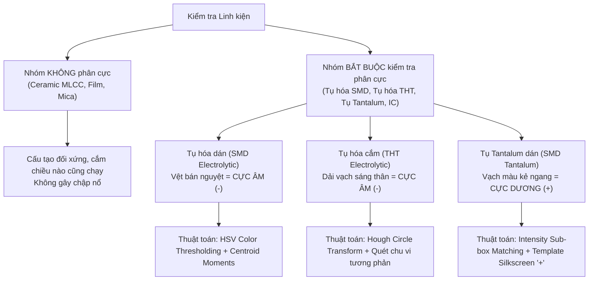

# BÁO CÁO TỔNG KẾT KẾT QUẢ THỰC HIỆN DỰ ÁN
## HỆ THỐNG KIỂM ĐỊNH QUANG HỌC TỰ ĐỘNG CHO BO MẠCH ĐIỆN TỬ (AOI PCB)

> **Cập nhật:** 2026-08-20  
> **Tổng hợp từ:** Thiết kế hệ thống, Thực nghiệm mã nguồn (`aoi_pipeline/`), Báo cáo tiến độ (`bao_cao_tien_do.md`), và Tài liệu nghiên cứu phân cực (`RP-Hệ-thống.docx`).  
> **Chất lượng kiểm thử tự động:** **243/243 tests pass (100%)**.

---

## I. TỔNG QUAN VÀ MỤC TIÊU DỰ ÁN

Dự án **Hệ thống Kiểm định Quang học Tự động cho Bo Mạch Điện Tử (Automated Optical Inspection - AOI PCB)** được nghiên cứu và phát triển nhằm tự động hóa quy trình kiểm tra chất lượng lắp ráp linh kiện, phân cực linh kiện và chất lượng mối hàn trên bo mạch (PCBA).

Mục tiêu cốt lõi của dự án là xây dựng một hệ thống hoàn chỉnh, kết hợp chặt chẽ giữa **Kỹ thuật Thị giác máy tính (Computer Vision)** truyền thống, **Mô hình Học sâu (Deep Learning)** hiện đại, **Quy luật quang học vật lý**, và **Dữ liệu thiết kế mạch (CAD/BOM/Pick-and-place)** nhằm đảm bảo 4 tiêu chuẩn công nghiệp:
1. **Không bỏ lọt lỗi nghiêm trọng (Zero Defect Escape):** Ưu tiên cảnh báo xem xét (*Review*) hơn là đưa ra kết luận Đạt sai lầm (*False Accept*).
2. **Khả năng giải thích minh bạch (Explainability):** Mọi phán quyết của hệ thống đều có thể truy xuất về các số đo vật lý cụ thể (diện tích thiếc, độ phản xạ kim loại, sai lệch tọa độ).
3. **Tối ưu hóa tài nguyên & Sẵn sàng cho Edge (Edge-Ready):** Chạy ổn định trên CPU tiêu chuẩn hoặc vi máy tính như Raspberry Pi (ARM64 ONNX Runtime).
4. **Vận hành linh hoạt (Graceful Degradation):** Hệ thống vẫn hoạt động chính xác dựa trên luật đo ngay cả khi chưa có mô hình AI hoặc chưa nạp sơ đồ CAD.

---

## II. ĐỐI CHIẾU TIẾN ĐỘ THỰC TẾ & BẢN ĐỒ QUY TRÌNH HỆ THỐNG

### 1. Bản đồ quy trình 8 bước tổng quan

```
0. Import ảnh (Gate >= 1280x960)
   → 1. Tiền xử lý & Sửa méo ống kính (Undistort / CLAHE / Denoise / White Balance)
   → 2. Căn chỉnh phối cảnh với Golden Image (ORB + RANSAC / ECC Fallback)
   → 3. Định vị & Khoanh vùng bo mạch (HSV + Otsu + Canny + Morphology)
   → 4. Phát hiện linh kiện (YOLO26s + Adaptive Tiling + Class-Aware NMS)
   → 5. Cắt & Chuẩn hóa linh kiện (Letterbox + Aspect Ratio Padding 0.15)
   → 5.5. Suy luận ROI mối hàn + Hợp nhất CAD + Tinh chỉnh theo kim loại (Refine to Metal)
   → 6.1. Phân loại họ linh kiện & Kiểm tra phân cực (ConvNeXt-Base / EfficientNet ONNX)
   → 6.2. Thẩm định chất lượng mối hàn đa tầng (Tầng A Đo vật lý + Tầng B CNN + Tầng C Escape Guard)
```

---

### 2. Bảng phân định trạng thái tiến độ thực tế (Trung thực & Minh bạch)

| Phân đoạn | Bước nghiệp vụ | Trạng thái kỹ thuật | Mô tả chi tiết tiến độ thực tế |
|---|---|:---:|---|
| **Pipeline 0–3** | Nạp ảnh, Tiền xử lý, Căn chỉnh & Định vị | **ĐÃ HOÀN THÀNH** | • Đã sửa lỗi OpenCV 5 corner detector trả về shape mới.<br>• Bộ lọc Camera Undistort ($RMS < 0.5\text{ px}$), CLAHE, Denoise, White Balance, Sharpening.<br>• Căn chỉnh Homography kép: ORB+RANSAC và ECC Affine Optimization.<br>• Định vị bo mạch chính xác bằng phân tích HSV, Otsu và Canny. |
| **Pipeline 4** | Phát hiện linh kiện (Detection) | **ĐÃ HOÀN THÀNH** | • Model v1: YOLO26s.<br>• Model v2: Huấn luyện trên Kaggle với oversample class hiếm (`pads`/`pins`), `imgsz=1536`, `copy_paste`, resume từ `last.pt`.<br>• Tích hợp thuật toán **Adaptive Tiling** và Class-Aware Global NMS. |
| **Pipeline 5 & 5.5**| Cắt ảnh, Suy luận ROI mối hàn & Hợp nhất CAD | **ĐÃ HOÀN THÀNH** | • Cắt ảnh chuẩn hóa Letterbox padding 0.15.<br>• **Suy luận ROI hình học:** Two-terminal, Multi-pin, Lọc năng lượng Laplacian, Tách chân 1D Profile.<br>• **3 lớp hợp nhất:** Lead detection thật per terminal $\rightarrow$ CAD Fusion $\rightarrow$ Refine to metal (tăng IoU từ 0.24 lên 0.70). |
| **Pipeline 6.1**| Phân loại họ linh kiện | **ĐÃ CÓ BASELINE & ĐANG TỐI ƯU V2** | • Model v1: EfficientNet-B0 ONNX Runtime + Manifest SHA-256 + 3-state decision (`accept`/`review`/`unknown`).<br>• Model v2: Nâng cấp lên **ConvNeXt-Base**, input 288px, Layer-wise LR decay (sửa lỗi decay đưa macro recall từ 0.731 $\rightarrow$ 0.883), EMA, TTA 4-view (đạt macro recall **0.942**). |
| **Pipeline 6.2**| Kiểm tra mối hàn đa tầng | **TẦNG A: XONG**<br>**TẦNG B: ĐANG TRAIN** | • **Tầng A (Luật đo vật lý):** 100% Hoàn thành (chạy độc lập không cần model AI).<br>• **Tầng B (AI CNN chấm khuyết tật):** Đang huấn luyện trên tập dữ liệu ghép (SolDef_AI, Roboflow, HuggingFace); đã sửa bộ đọc LabelMe cho 428 ảnh SolDef_AI.<br>• **Tầng C (Chốt chặn an toàn):** `escape_guard` bảo vệ 100% chống lọt lỗi. |
| **Hệ sinh thái**| Web App, Scripts, Calibration & Tests | **ĐÃ HOÀN THÀNH** | • Giao diện Streamlit Web App trực quan.<br>• Scripts: `calibrate_camera.py`, `calibrate_solder_thresholds.py`, `export_solder_dataset.py`.<br>• Bộ test hoàn chỉnh: **243/243 Tests Passed**. |

---

## III. NGHIÊN CỨU CHUYÊN SÂU: KIỂM TRA ĐÚNG – SAI – LỆCH VÀ PHÂN CỰC LINH KIỆN (POLARITY & ORIENTATION INSPECTION)

Trong quy trình AOI, kiểm tra lắp ráp đúng linh kiện, đúng vị trí và đúng chiều phân cực là yêu cầu sống còn nhằm tránh nguy cơ cháy nổ bo mạch.



### 1. Phân loại linh kiện theo yêu cầu phân cực

#### A. Nhóm linh kiện KHÔNG CẦN kiểm tra chiều:
* **Tụ gốm (Ceramic Capacitors / SMD MLCC):** Các khối chữ nhật dán màu nâu đất, xám nhạt (như C12, C38, C39) hoặc tụ gốm cắm chân hình đĩa dẹt.
* **Tụ màng phim (Film Capacitors / Tụ kẹo):** Hình hộp chữ nhật màu đỏ, xanh, vàng.
* **Tụ Mica, Tụ giấy:**
* *Nguyên nhân vật lý:* Cấu tạo bản cực kim loại song song/cuộn tròn đối xứng $100\%$, vật liệu điện môi vô hướng, không có phản ứng hóa học một chiều. Hàn đảo đầu đuôi dòng điện vẫn hoạt động bình thường, không gây chập cháy hay nổ.

#### B. Nhóm linh kiện BẮT BUỘC PHẢI KIỂM TRA CHIỀU (Nguy cơ nổ mạch khi đảo cực):
1. **Tụ hóa dán bề mặt (SMD Electrolytic Capacitor):**
   * *Đặc điểm:* Hình trụ tròn vỏ nhôm, đế nhựa vuông đen.
   * *Dấu hiệu nhận diện:* Phần lưng đỉnh tụ có **vệt màu bán nguyệt (đen/xanh/đỏ)** chỉ định **CỰC ÂM (-)**.
   * *Dấu hiệu trên PCB:* Footprint cực âm có vạch kẻ chéo hoặc pad hàn bị vát một góc.
2. **Tụ hóa cắm chân (THT Electrolytic Capacitor):**
   * *Đặc điểm:* Hình trụ nilon (đen, xanh, nâu).
   * *Dấu hiệu nhận diện:* Chạy dọc thân tụ có **dải màu sáng (trắng/xám) in các dấu trừ (-)** liên tiếp chỉ định **CỰC ÂM (-)**.
   * *Dấu hiệu trên PCB:* Vòng tròn in lụa (Silkscreen) chia 2 nửa, nửa gạch sọc/tô trắng là cực âm.
3. **Tụ Tantalum dán (SMD Tantalum Capacitor) — [QUY TẮC ĐẶC BIỆT]:**
   * *Đặc điểm:* Khối hình chữ nhật màu vàng hoặc đen.
   * *Dấu hiệu nhận diện:* Một đầu thân tụ có in **vạch kẻ ngang khác màu** (vạch nâu/đen trên nền vàng, hoặc vạch trắng trên nền đen).
   * **SỰ KHÁC BIỆT CỐT LÕI:** Ngược lại hoàn toàn với tụ hóa, **vạch màu trên tụ Tantalum chỉ định CỰC DƯƠNG (+)**. Rất nhiều kỹ sư và hệ thống AOI thông thường bị nhầm lẫn quy tắc này dẫn đến đánh giá sai.
   * *Dấu hiệu trên PCB:* Kỹ sư in sẵn dấu `+` ở vị trí đặt đầu vạch của tụ.

---

### 2. Thuật toán Thị giác máy tính kiểm tra phân cực & lệch vị trí

1. **Kiểm tra Tụ hóa dán bề mặt (SMD Electrolytic):**
   * Chuyển crop linh kiện sang không gian màu **HSV**, dùng Color Thresholding cô lập vệt bán nguyệt.
   * Tìm đường viền (*Contour*) và tính toán khối tâm (*Centroid via Moments* $m_{10}/m_{00}, m_{01}/m_{00}$). Vì có dạng bán nguyệt, khối tâm bị lệch hẳn về một phía so với tâm hình học của tụ.
   * Quét vùng footprint trên PCB bằng *Template Matching* để tìm góc vát / vùng gạch chéo cực âm.
   * **Phán quyết:** Tọa độ khối tâm vệt bán nguyệt phải hướng về cùng phía với góc vát footprint. Nếu ngược lại $\rightarrow$ Cảnh báo lỗi `wrong_polarity`.

2. **Kiểm tra Tụ hóa cắm chân (THT Electrolytic):**
   * Ứng dụng thuật toán biến đổi **Hough Circle Transform** (`cv2.HoughCircles`) để định vị đường tròn đỉnh tụ từ góc nhìn thẳng đứng (*Top-down view*).
   * Quét dọc theo chu vi hình tròn để tìm dải màu sáng (trắng/xám) có độ tương phản cao với vỏ nilon tối màu.
   * Quét vòng tròn in lụa (*Silkscreen*) bao quanh trên mạch để lọc nửa vòng gạch sọc.
   * **Phán quyết:** Tính góc tọa độ của dải màu sáng so với tâm tụ, đối chiếu góc này với góc của nửa vòng tròn cực âm in lụa.

3. **Kiểm tra Tụ Tantalum dán (SMD Tantalum):**
   * Chia khung Bounding Box của tụ thành 2 nửa đối xứng (trái/phải hoặc trên/dưới).
   * Tính tổng cường độ sáng pixel (*Pixel Intensity Sum*) của từng nửa để xác định đầu chứa vạch màu (cực dương).
   * Dùng Template Matching quét tìm ký hiệu dấu `+` in lụa trên bo mạch.
   * **Phán quyết:** Đầu có vạch màu (cực dương) bắt buộc phải hướng về phía có dấu `+`. Nếu phát hiện quay ngược lại $\rightarrow$ Lập tức gắn cờ lỗi nghiêm trọng `wrong_polarity` / `Reversed`.

4. **Kiểm tra độ lệch tọa độ và góc xoay của linh kiện (Position Check):**
   * **Mục đích (Đang làm gì?):** Đo chính xác xem linh kiện sau khi hàn có bị trượt khỏi vị trí thiết kế hay không (trượt sang trái/phải, trượt lên/xuống bao nhiêu mm) và có bị xoay nghiêng góc nào không.
   * **Vì sao không dùng AI để đo tọa độ?** Mô hình AI rất giỏi "nhìn ra" có linh kiện, nhưng khung nhận diện của AI bị rung lắc qua từng ảnh chụp, không thể làm thước đo milimet chuẩn xác. AI chỉ đóng vai trò "chỉ vị trí", còn đo đạc chi tiết giao cho thuật toán xử lý ảnh chuyên dụng.
   * **Cách thực hiện (Dùng gì để làm?):**
     * *Bước 1 - Dò tìm tọa độ sơ bộ:* Lấy hình ảnh linh kiện mẫu chuẩn đem quét trượt xung quanh vùng thiết kế để tìm tọa độ lệch gần đúng (lệch ngang, lệch dọc bao nhiêu pixel).
     * *Bước 2 - Dời khung hình & chống cắt cụt ảnh:* Dời khung chụp bám theo đúng tọa độ lệch vừa tìm được. Nếu linh kiện bị lệch văng sát mép ảnh, hệ thống tự động "đắp thêm viền đen" xung quanh để linh kiện không bị cắt cụt mất góc cạnh.
     * *Bước 3 - Đo tọa độ siêu mịn & góc nghiêng:* Dùng thuật toán tinh chỉnh tương quan quang học để tính ra độ lệch tọa độ chính xác đến từng phần mười pixel và góc xoay nghiêng (độ).
   * **Phán quyết:** Quy đổi độ lệch từ pixel sang milimet (mm). Nếu khoảng cách lệch tọa độ hoặc góc xoay vượt quá ngưỡng an toàn cho phép (ví dụ: lệch quá $0.5\text{ mm}$ hoặc nghiêng quá $5^\circ$) $\rightarrow$ Báo lỗi `shifted_component` (Hàn lệch vị trí).
5. **So sánh ngoại quan với mẫu chuẩn để tìm lỗi xước, vỡ, sai loại (Golden Compare):**
   * **Mục đích (Đang làm gì?):** Kiểm tra xem thân linh kiện có bị nứt vỡ, trầy xước bề mặt, lem mực, dính dị vật lạ, mất chữ in hoặc bị cắm nhầm loại linh kiện khác hay không.
   * **Vấn đề cần giải quyết:** Nếu một linh kiện chỉ bị hàn xoay nghiêng nhẹ $1^\circ - 2^\circ$, khi đem đè lên ảnh mẫu chuẩn để so sánh thì phần mép bị nghiêng sẽ không khớp nhau, khiến máy nhìn nhầm viền linh kiện thành "vết xước/dị vật" và báo lỗi sai.
   * **Cách thực hiện (Dùng gì để làm?):**
     * *Bước 1 - Nắn thẳng linh kiện về đúng vị trí chuẩn:* Dùng thuật toán xoay và kéo nắn linh kiện thực tế quay ngược trở lại, đưa về đúng tâm và đúng hướng thẳng tắp y hệt như linh kiện mẫu chuẩn.
     * *Bước 2 - Tạo mặt nạ bảo vệ vùng bo mạch:* Chỉ khoanh vùng soi kỹ trên phần thân linh kiện, tự động che đi phần nền bo mạch xung quanh để không bị ảnh hưởng bởi màu sơn hay đường mạch bên dưới.
     * *Bước 3 - Chấm điểm khuyết tật:* Đổi ảnh sang hệ màu mô phỏng mắt người. Hệ thống cùng lúc đánh giá 4 yếu tố: độ nét cấu trúc, độ lệch màu sắc, biến dạng méo viền và diện tích các đốm lạ.
   * **Phán quyết:** Nếu phát hiện các đốm lạ loang lổ, bề mặt biến dạng hoặc hoa văn chữ in sai khác so với mẫu chuẩn $\rightarrow$ Báo lỗi `appearance_anomaly` (Khuyết tật ngoại quan linh kiện).
---

## IV. TỔNG HỢP TOÀN DIỆN CÁC KỸ THUẬT XỬ LÝ ẢNH SỐ ĐÃ SỬ DỤNG

Hệ thống đã triển khai một chuỗi xử lý ảnh số toàn diện từ mức phần cứng camera đến từng mối hàn vi mô:

| STT | Nhóm chức năng | Thuật toán / Kỹ thuật | Hàm OpenCV / Code triển khai | Vai trò kỹ thuật trong AOI PCB |
|---|---|---|---|---|
| **1** | **Hiệu chuẩn Camera** | • Mô hình camera lỗ kim (Pinhole)<br>• Mẫu bàn cờ chuẩn (Chessboard)<br>• Sửa méo phi tuyến (Undistort) | `cv2.findChessboardCorners`<br>`cv2.cornerSubPix`<br>`cv2.calibrateCamera`<br>`cv2.getOptimalNewCameraMatrix`<br>`cv2.undistort` | • Đo ma trận nội tại $K$ và hệ số méo $D$.<br>• Triệt tiêu độ cong méo ống kính, đưa đường mạch cong về thẳng ($RMS < 0.5\text{ px}$). Sửa lỗi tương thích shape OpenCV 5. |
| **2** | **Tăng cường ảnh** | • Cân bằng trắng Gray-World<br>• CLAHE trên kênh Lightness (LAB)<br>• Khử nhiễu NlMeans / Bilateral / Gaussian<br>• Chuẩn hóa dải sáng (Percentile Stretching)<br>• Làm nét Unsharp Masking | `cv2.cvtColor(..., cv2.COLOR_BGR2LAB)`<br>`cv2.createCLAHE(clipLimit, grid)`<br>`cv2.fastNlMeansDenoisingColored`<br>`cv2.bilateralFilter`<br>`cv2.addWeighted(img, 1+a, blur, -a, 0)` | • Triệt tiêu sai lệch màu sắc đèn chiếu sáng.<br>• Tăng tương phản chân linh kiện/mối hàn mà không gây cháy sáng bề mặt kim loại.<br>• Khử nhiễu hạt cảm biến nhưng bảo toàn cạnh viền. |
| **3** | **Căn chỉnh phối cảnh Bo mạch** | • Trích xuất đặc trưng ORB<br>• Khớp đặc trưng BFMatcher + Lowe's Test<br>• Ước lượng Homography bằng RANSAC<br>• Tối ưu tương quan ECC (Affine Fallback)<br>• Biến đổi phối cảnh Warp Perspective | `cv2.ORB_create`<br>`cv2.BFMatcher(cv2.NORM_HAMMING)`<br>`cv2.findHomography(..., cv2.RANSAC)`<br>`cv2.warpPerspective`<br>`cv2.findTransformECC(..., cv2.MOTION_AFFINE)` | • Tự động xoay, dịch chuyển và khử góc nghiêng của bo mạch cần kiểm tra để khớp từng pixel với ảnh mẫu chuẩn (*Golden Image*).<br>• Thuật toán kép: ORB+RANSAC căn nhanh toàn cục; ECC tinh chỉnh sub-pixel. |
| **4** | **Định vị bo mạch (Localization)** | • Phân tích kênh Saturation (HSV)<br>• Phân ngưỡng tự động Otsu<br>• Dò biên Canny thích ứng theo Median<br>• Hình thái học Morph Close & Open<br>• Phân cấp đường viền (Contour Hierarchy)<br>• Bao chữ nhật tối thiểu (MinAreaRect) | `cv2.cvtColor(..., cv2.COLOR_BGR2HSV)`<br>`cv2.threshold(..., cv2.THRESH_OTSU)`<br>`cv2.Canny(..., lower, upper)`<br>`cv2.morphologyEx(..., cv2.MORPH_CLOSE)`<br>`cv2.findContours(..., cv2.RETR_EXTERNAL)`<br>`cv2.minAreaRect`, `cv2.moments` | • Tách bo mạch ra khỏi nền bàn gá/bóng đổ.<br>• Lấp đầy lỗ via và khe mạch để tạo mặt nạ liền khối.<br>• Chấm điểm ứng viên theo diện tích, độ chữ nhật (*rectangularity*) và khoảng cách tới tâm khung hình. |
| **5** | **Xử lý cửa sổ phát hiện thích ứng** | • Phân chia lưới thích ứng (Adaptive Tiling)<br>• Vùng phân định sở hữu (Ownership Zone)<br>• Khử trùng lặp Class-Aware Global NMS | Thuật toán chia lưới động 640–1280 px + Gộp tọa độ toàn cục + IoU Overlap Suppression | • Giải quyết bài toán linh kiện siêu nhỏ (0402, 0201) trên ảnh 4K/8K mà không bị mờ nét khi đưa vào YOLO.<br>• Loại bỏ hiện tượng linh kiện bị cắt làm đôi ở mép tile. |
| **6** | **Cắt ảnh & Chuẩn hóa linh kiện** | • Mở rộng viền động ($0.15 \times \max(W, H)$)<br>• Chuẩn hóa Letterbox giữ nguyên tỷ lệ | Trích xuất Sub-pixel từ ảnh Full-Res + `cv2.copyMakeBorder` viền xám trung tính (114) | • Cắt trọn vẹn cả thân và phần chân tiếp giáp.<br>• Tránh biến dạng méo hình học linh kiện trước khi đưa vào mạng phân loại (*Classifier*). |
| **7** | **Suy luận hình học mối hàn** | • Ước lượng góc nghiêng (Orientation)<br>• Lọc năng lượng biên Laplacian<br>• Phân tích Profile cường độ 1-D<br>• Thu hẹp theo kim loại thật (Refine to metal) | `cv2.minAreaRect`<br>`cv2.Laplacian`<br>`profile = solder_mask.sum(axis=0)`<br>`refine_joint_to_metal` | • Tự động sinh ROI mối hàn ở 2 đầu linh kiện 2 cực hoặc dải chân IC.<br>• Đo năng lượng Laplacian trên 4 cạnh IC để tự động loại bỏ cạnh không có chân (SOIC chỉ lấy 2 cạnh có chân).<br>• Chiếu 1D để tách dải thành từng chân đơn lẻ.<br>• Thu hẹp ROI về đúng vùng kim loại bên trong (tăng IoU từ 0.24 lên 0.70). |
| **8** | **Đo đặc trưng quang học mối hàn** | • Phân đoạn kim loại HSV: $(V \ge V_{Otsu}) \land (S \le 110)$<br>• Đo tỷ lệ phản xạ gương (Specular Ratio)<br>• Độ tương phản nền kim loại/solder mask<br>• Độ đồng đều lớp thiếc (Uniformity Profile)<br>• Độ lệch tâm vật lý (Centroid Offset)<br>• Phân tích dính thiếc liên biên (Edge Contact) | Phân ngưỡng kết hợp HSV<br>`np.percentile(value, 99.0)`<br>`cv2.moments(solder_mask)`<br>`np.std(profile) / np.mean(profile)`<br>Đo tỷ lệ phủ thiếc tại biên chung giữa 2 chân kề | • Tách chính xác vùng thiếc hàn mà không bị nhầm với lớp phủ xanh (*Solder mask*) hay chữ in (*Silkscreen*).<br>• Đo độ bóng kim loại để bắt lỗi mối hàn nguội (*Cold joint*).<br>• Phán quyết chắc chắn lỗi: Thiếu thiếc, thừa thiếc, lệch tâm, chập cầu chì (*Bridge*) hoàn toàn bằng vật lý. |
| **9** | **Trực quan hóa & Xuất bản** | • Phủ màu bán trong suốt (Alpha Blending)<br>• Vẽ đường bao đa giác & Bounding Box<br>• Bản đồ lưới kiểm tra (Debug Tiling Grid) | `cv2.addWeighted`<br>`cv2.rectangle`, `cv2.polylines`<br>`cv2.putText` | • Xuất ảnh trực quan chuẩn màu công nghiệp: Xanh lá (Đạt), Vàng (Cảnh báo/Xem xét), Đỏ (Lỗi/Loại bỏ), Xanh dương (Chưa rõ/Unknown). |

---

## V. CÁC ĐỘT PHÁ KỸ THUẬT TRỌNG TÂM & GIẢI PHÁP ĐÃ THỰC THI

### 1. Giải quyết bài toán linh kiện siêu nhỏ bằng Adaptive Tiling
* **Vấn đề:** Trên ảnh toàn mạch 4K/8K, linh kiện 0402/0201 bị mất chi tiết nếu resize về $640 \times 640$.
* **Giải pháp:** Xây dựng module `detection/tiling.py` tự động chia ảnh thành các cửa sổ con 640–1280 px (overlap 20%), thiết lập vùng sở hữu (*Ownership Box*) ở trung tâm để ưu tiên box nguyên vẹn, và dùng *Class-Aware Global NMS* (loại trùng lặp đa lớp $IoU > 0.70$) để chuyển toàn bộ detection về tọa độ ảnh gốc.

### 2. Suy luận hình học ROI mối hàn 3 tầng tích hợp
* **Vấn đề:** Không tập dữ liệu công khai nào gán nhãn riêng cho fillet mối hàn (chỉ gán nhãn thân linh kiện).
* **Giải pháp:** Xây dựng giải thuật suy luận hình học không gian kết hợp **3 lớp hợp nhất theo thứ tự ưu tiên**:
  1. **Lead/Pad detection thật (`inspection/leads.py`):** Ưu tiên dùng box chân/pad phát hiện được theo từng chân độc lập.
  2. **CAD Fusion (`inspection/cad.py`, `fusion.py`):** Hợp nhất tọa độ pad từ CAD, tự động bù sai lệch cục bộ (*Local offset*) cho từng linh kiện.
  3. **Thu hẹp theo kim loại thật (`refine_to_metal`):** Tự động co ROI dự đoán về đúng đường bao kim loại thực tế bên trong, đo được cải thiện IoU từ **0.24 $\rightarrow$ 0.70** trên bo mạch tổng hợp và **16/24 ROI** trên bo mạch thật.

### 3. Nâng cấp mô hình Phân loại 6.1: ConvNeXt-Base & Layer-wise LR Decay
* **Thực nghiệm v2 (`pcb_classifier_v2_kaggle.py`):** Nâng cấp kiến trúc từ baseline EfficientNet-B0 lên **ConvNeXt-Base** (input 288px).
* **Tối ưu huấn luyện:** Sửa lỗi Layer-wise LR Decay giúp cải thiện Macro Recall từ **0.731 $\rightarrow$ 0.883**.
* **Đo lường thực nghiệm:** Kết hợp Exponential Moving Average (EMA) và Test-Time Augmentation (TTA 4-view) đưa Macro Recall đạt mức **0.942**.

### 4. Kiến trúc Thẩm định Mối hàn 3 tầng & Chốt chặn an toàn (Escape Guard)
* **Tầng A (Luật đo vật lý):** Đo các chỉ số quang học thực tế (`solder_ratio`, `specular_ratio`, `centroid_offset`, `edge_contact`), phán quyết lỗi kèm chuỗi lý do minh bạch, chạy được ngay từ ngày đầu không cần dữ liệu train.
* **Tầng B (Mô hình AI CNN):** Nhận diện các khuyết tật hình thái phức tạp.
* **Tầng C (Bộ hợp nhất & Chốt chặn):** `escape_guard` đóng vai trò sàn vật lý an toàn: nếu lượng thiếc đo được dưới ngưỡng tối thiểu, dù AI có tự tin là "Good" thì hệ thống vẫn chặn lại và bắt buộc đưa vào hàng đợi xem xét (*Review*).

### 5. Xử lý và Hợp nhất tập dữ liệu mối hàn 6.2
* Do không có tập dữ liệu công khai nào chứa đủ taxonomy mối hàn, nhóm đã xây dựng cơ chế tự động dò và ghép layout đa nguồn (COCO, YOLO, LabelMe, CSV).
* **Sửa lỗi thực tế:** Đã viết bộ đọc LabelMe cho 428 ảnh từ bộ dữ liệu SolDef_AI; tải tự động dữ liệu Hugging Face (`hf_soldering_boarding`).
* Chuẩn hóa nhãn thô: ánh xạ `exc_solder`, `spike` $\rightarrow$ `excess`; cô lập 145 mẫu `no_good`/`poor_solder` để chuyên gia xem xét trực quan trước khi gán nhãn.

---

## VI. BẢNG TỔNG HỢP DANH MỤC KHUYẾT TẬT ĐÃ KIỂM SOÁT

| Phân nhóm | Mã Khuyết Tật | Tên Tiếng Việt | Cơ Chế Phát Hiện | Phán Quyết |
|---|---|---|---|:---:|
| **Linh kiện** | `missing_component` | Thiếu / Rơi mất linh kiện | CAD Fusion / Tier A Body ROI Solder Ratio | `reject` |
| | `shifted_component` | Lệch vị trí / Xoay góc | So sánh tọa độ Detector vs CAD ($> 0.5\text{ mm}$) | `review` |
| | `wrong_polarity` | Ngược chiều / Sai cực tính | HSV Centroid / Hough Circle / Intensity Halves vs Silkscreen | `reject` |
| | `tombstone` | Linh kiện bị dựng bia | So sánh chênh lệch thiếc & phản xạ 2 đầu cực | `reject` |
| | `unexpected_component`| Linh kiện lạ ngoài thiết kế | Đối chiếu dư thừa so với sơ đồ CAD | `review` |
| | `class_mismatch` | Cắm sai loại linh kiện | Đối chiếu Detector/Classifier vs CAD | `review` |
| **Mối hàn** | `insufficient` | Thiếu thiếc / Fillet mỏng | `solder_ratio` dưới ngưỡng tối thiểu | `reject` |
| | `excess` | Thừa thiếc / Đọng thiếc | `solder_ratio` vượt ngưỡng tối đa | `reject` |
| | `bridge` | Dính thiếc / Chập chân | Thiếc phủ kín biên chung giữa 2 chân kề (`edge_contact`) | `reject` |
| | `cold` | Mối hàn nguội / Khô, xỉn | Độ phản xạ gương thấp + Độ tương phản kém | `review` / `reject` |
| | `missing_solder` | Mất thiếc hoàn toàn | Không có ánh kim loại trên bề mặt pad | `reject` |

---

## VII. CÁC GIỚI HẠN THỰC TẾ & KẾ HOẠCH ƯU TIÊN TIẾP THEO

### 1. Giới hạn tồn tại thực tế (Đánh giá khách quan)
1. **Độ phủ dữ liệu của Detector:** Trong 22 lớp của tập dữ liệu công khai, chỉ có **3 lớp đạt chuẩn số lượng** (`capacitor`, `resistor`, `ic` chiếm tới **81%** dữ liệu); 9 lớp có dưới 100 mẫu và 3 lớp không có mẫu kiểm thử trên tập validation.
2. **Thiếu mẫu lỗi mối hàn hiếm:** Các lỗi như `bridge`, `cold`, `tombstone` rất hiếm trong các tập dữ liệu công khai; 145 mẫu `no_good`/`poor_solder` từ SolDef_AI đang chờ chuyên gia phân loại thủ công.
3. **Nút thắt vật lý quang học:**
   * Lỗi mối hàn nguội (*Cold solder*) cần hệ thống **đèn vòm RGB đa góc** mới có thể tách biệt triệt để góc nghiêng bề mặt so với mối hàn tốt dưới ánh sáng phẳng.
   * Để phân tích chi tiết fillet mối hàn linh kiện 0402, hệ thống cần độ phân giải quang học thực tế đạt $\approx 15–25\text{ µm/px}$.
4. **Nghi vấn lệch miền tiền xử lý (Domain Gap):** Chuỗi tiền xử lý (Denoise/CLAHE/Normalize) ở Bước 1 chưa được áp dụng đồng bộ trên toàn bộ tập ảnh huấn luyện công khai, cần được đánh giá định lượng bằng công cụ `scripts/compare_preprocessing_ab.py`.

### 2. Kế hoạch hành động ưu tiên tiếp theo
1. **Kiểm thử mô hình v2 trên Kaggle:** Hoàn tất nghiệm thu kết quả huấn luyện của Detector v2 (YOLO26s với oversampling) và Classifier v2 (ConvNeXt-Base) qua cổng so sánh tự động (*verdict gate*).
2. **Chạy A/B Testing tiền xử lý:** Sử dụng script `compare_preprocessing_ab.py --isolate` trên ảnh bo mạch thực tế để quyết định bật/tắt từng bộ lọc dựa trên số đo chính xác.
3. **Gán nhãn bộ dữ liệu SolDef_AI:** Xem xét ảnh mẫu của 145 trường hợp `no_good`/`poor_solder` để bổ sung vào bản đồ nhãn `LABEL_MAPS`, giúp tăng gần gấp đôi dữ liệu huấn luyện mối hàn.
4. **Thu thập dữ liệu thực tế tại dây chuyền:** Tự xuất và gán nhãn tập dữ liệu từ chính camera và bo mạch thực tế thông qua công cụ `scripts/export_solder_dataset.py --overlays` để đạt độ chính xác tối đa trong môi trường sản xuất.
