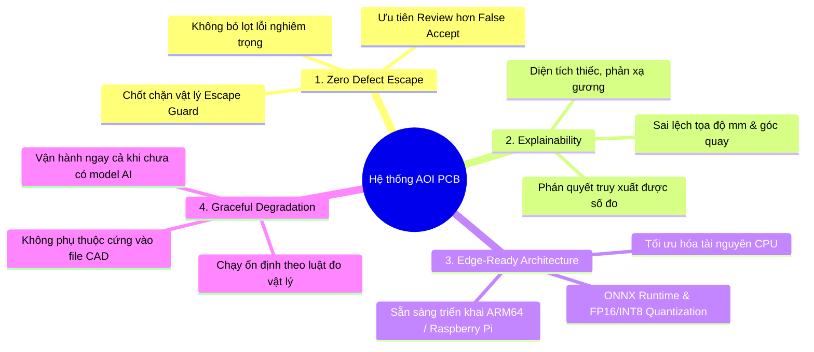
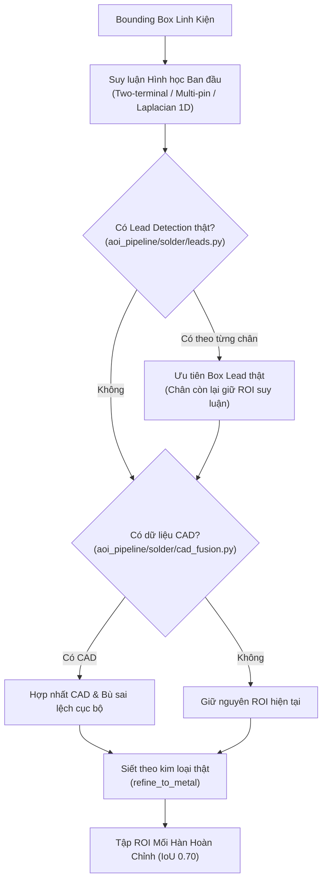
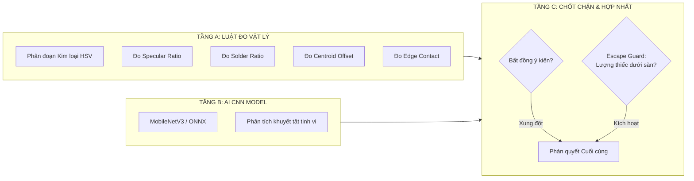
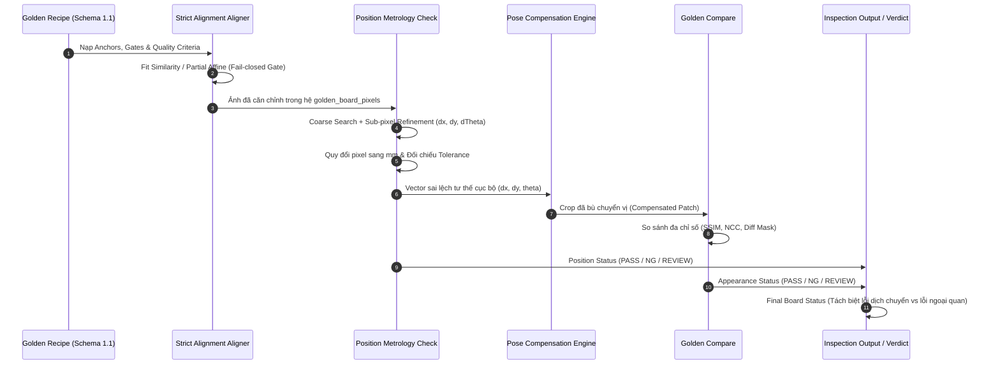
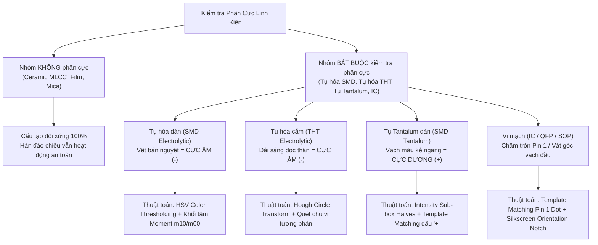

# BÁO CÁO TỔNG KẾT KẾT QUẢ THỰC HIỆN DỰ ÁN
## HỆ THỐNG KIỂM ĐỊNH QUANG HỌC TỰ ĐỘNG CHO BO MẠCH ĐIỆN TỬ (AOI PCB)

> **Thời gian cập nhật:** 21/08/2026  
> **Dự án:** Automated Optical Inspection for Printed Circuit Board Assembly (AOI PCBA)  
> **Tài liệu tham chiếu:** Thiết kế hệ thống, Thực nghiệm mã nguồn ([`aoi_pipeline/`](../../../aoi_pipeline)), Báo cáo tiến độ ([`Docs/bao_cao/bao_cao_tien_do.md`](../bao_cao_tien_do.md)), Hướng dẫn huấn luyện ([`training/kaggle/`](../../../training/kaggle)), và Nghiên cứu phân cực linh kiện.  
> **Chất lượng mã nguồn:** 340+ kiểm thử tự động (Unit / Integration Tests).

---

## I. TỔNG QUAN VÀ MỤC TIÊU DỰ ÁN

Dự án **Hệ thống Kiểm định Quang học Tự động cho Bo Mạch Điện Tử (Automated Optical Inspection - AOI PCB)** được nghiên cứu và phát triển nhằm tự động hóa quy trình kiểm tra chất lượng sau gắn linh kiện bề mặt (SMT) và hàn linh kiện trên bo mạch (PCBA).

Mục tiêu cốt lõi của dự án là xây dựng một hệ thống hoàn chỉnh, kết hợp hài hòa giữa **Kỹ thuật Thị giác máy tính truyền thống (Computer Vision)**, **Mô hình Học sâu hiện đại (Deep Learning)**, **Quy luật quang học vật lý**, và **Dữ liệu thiết kế mạch (CAD/BOM/Pick-and-place)** nhằm đảm bảo 4 tiêu chuẩn công nghiệp:



1. **Không bỏ lọt lỗi nghiêm trọng (Zero Defect Escape):** Ưu tiên cảnh báo xem xét (*Review*) hơn là đưa ra kết luận Đạt sai lầm (*False Accept*). Thà tốn vài giây của nhân viên kiểm tra lại còn hơn xuất xưởng một bo mạch lỗi gây chập cháy.
2. **Khả năng giải thích minh bạch (Explainability):** Mọi phán quyết của hệ thống đều có thể truy xuất về các số đo vật lý cụ thể (diện tích thiếc, độ phản xạ kim loại, sai lệch tọa độ $\Delta x, \Delta y\text{ mm}$, góc xoay $\Delta\theta$).
3. **Tối ưu hóa tài nguyên & Sẵn sàng cho Edge (Edge-Ready):** Chạy mượt mà trên CPU tiêu chuẩn hoặc vi máy tính như Raspberry Pi 4/5 thông qua runtime tối ưu hóa ONNX Runtime (ARM64).
4. **Vận hành linh hoạt (Graceful Degradation):** Hệ thống vẫn hoạt động chính xác dựa trên luật đo vật lý (Tầng A) ngay cả khi chưa có mô hình AI huấn luyện hoặc chưa nạp sơ đồ CAD.

---

## II. KIẾN TRÚC HỆ THỐNG & HAI WORKSPACE VẬN HÀNH

Hệ thống được thiết kế theo cấu trúc module hóa cao ([`aoi_pipeline/`](../../../aoi_pipeline)), phân định rõ ràng 2 không gian làm việc (*Workspace*) phục vụ hai mục đích chuyên biệt:

```mermaid
flowchart TD
    subgraph WS1 ["WORKSPACE 1: Pipeline Kiểm Định 8 Bước (R&D & Deep Inspection)"]
        S0["0. Import & Gate Ảnh (>= 1280x960)"] --> S1["1. Hiệu Chuẩn Lens & Tiền Xử Lý (Undistort/CLAHE/Denoise)"]
        S1 --> S2["2. Căn Chỉnh Bo Mạch (ORB+RANSAC / ECC Fallback)"]
        S2 --> S3["3. Định Vị Bo Mạch (HSV + Otsu + Canny + MinAreaRect)"]
        S3 --> S4["4. Phát Hiện Linh Kiện (YOLO26s + Adaptive Tiling)"]
        S4 --> S5["5. Cắt & Chuẩn Hóa Linh Kiện (Sub-pixel Letterbox)"]
        S5 --> S55["5.5. Suy Luận ROI Chân/Mối Hàn (Hình học + CAD + Refine to Metal)"]
        S55 --> S61["6.1. Phân Loại Họ Linh Kiện (ConvNeXt-Base / EfficientNet ONNX)"]
        S55 --> S62["6.2. Thẩm Định Mối Hàn 3 Tầng (Vật Lý + CNN + Escape Guard)"]
    end

    subgraph WS2 ["WORKSPACE 2: Golden Inspection (Metrology & Recipe Production)"]
        G1["Nạp Golden Image Chuẩn"] --> G2["Tạo & Xác Thực Recipe Schema 1.1 (SHA-256)"]
        G2 --> G3["Strict Alignment (Fiducials/Anchors + Sanity Gate)"]
        G3 --> G4["Position Check (Đo dx, dy mm, góc quay dTheta)"]
        G4 --> G5["Pose Compensation (Bù Sai Lệch Vị Trí)"]
        G5 --> G6["Golden Compare (So Sánh Ngoại Quan: SSIM, NCC, Diff Mask)"]
        G6 --> G7["Tách Bạch 3 Trạng Thái: Position / Appearance / Board Status"]
    end
```



---

## III. CHI TIẾT CÁC HẠNG MỤC ĐÃ HOÀN THÀNH

### 1. Phân đoạn 0–3: Nạp ảnh, Hiệu chuẩn ống kính, Căn chỉnh & Định vị bo mạch

* **Cổng tiếp nhận ảnh nghiêm ngặt (Step 0 - [`aoi_pipeline/imaging/image_io.py`](../../../aoi_pipeline/imaging/image_io.py)):**
  * Thiết lập ngưỡng chất lượng tối thiểu $\ge 1280 \times 960\text{ px}$ ($1.23\text{ MP}$), dung lượng tối đa $64\text{ MB} / 50\text{ MP}$ để đảm bảo độ phân giải quang học cho linh kiện siêu nhỏ.
  * Chặn ảnh giả mạo hoặc ảnh nén suy hao nặng ngay từ đầu vào.

* **Hiệu chuẩn Camera & Khử méo phi tuyến (Step 1 - [`aoi_pipeline/imaging/calibration.py`](../../../aoi_pipeline/imaging/calibration.py), [`aoi_pipeline/imaging/preprocessing.py`](../../../aoi_pipeline/imaging/preprocessing.py)):**
  * Xây dựng công cụ hiệu chuẩn mẫu bàn cờ ([`scripts/calibrate_camera.py`](../../../scripts/calibrate_camera.py)) ước lượng ma trận nội tại $K$ và hệ số méo Brown-Conrady $D$ với sai số tái chiếu $RMS < 0.5\text{ px}$.
  * **Sửa lỗi tương thích quan trọng:** Xử lý triệt để thay đổi shape trả về của corner detector trong OpenCV 5, bổ sung regression test bảo vệ.
  * Chuỗi tiền xử lý đa tầng: Cân bằng trắng Gray-World, lọc tương phản thích ứng CLAHE trên kênh $L$ (không gian màu LAB), khử nhiễu Non-Local Means / Bilateral / Gaussian, chuẩn hóa dải sáng Percentile Stretching (1.0%–99.0%), và làm nét Unsharp Masking.

* **Căn chỉnh phối cảnh 2 tầng (Step 2 - [`aoi_pipeline/imaging/alignment.py`](../../../aoi_pipeline/imaging/alignment.py)):**
  * Tầng 1 (Toàn cục nhanh): Trích xuất đặc trưng ORB, so khớp Brute-Force Matcher với Lowe's Ratio Test ($0.75$), ước lượng ma trận Homography $3 \times 3$ bằng RANSAC.
  * Tầng 2 (Tinh chỉnh sub-pixel): Tối ưu hóa hệ số tương quan tăng cường ECC (Enhanced Correlation Coefficient Maximization) với mô hình Affine/Euclidean, đưa bo mạch test khớp chính xác từng pixel với ảnh mẫu (*Golden Image*).

* **Định vị & Khoanh vùng bo mạch (Step 3 - [`aoi_pipeline/imaging/board.py`](../../../aoi_pipeline/imaging/board.py)):**
  * Phân tích kênh Saturation (HSV), kết hợp phân ngưỡng Otsu tự động và Canny edge detector thích ứng theo Median.
  * Áp dụng phép toán hình thái học Morphological Close & Open, phân cấp đường viền ngoài (*RETR_EXTERNAL*) và tính bao chữ nhật tối thiểu (*MinAreaRect*) để tách trọn vẹn PCB ra khỏi nền bàn gá và bóng đổ.

---

### 2. Phân đoạn 4: Phát hiện linh kiện (Component Detection) & Adaptive Tiling

* **Mô hình YOLO26s thế hệ mới ([`aoi_pipeline/detection/detectors.py`](../../../aoi_pipeline/detection/detectors.py)):**
  * Tích hợp kiến trúc YOLO26 với cơ chế STAL (Small-Target-Aware Label Assignment) tối ưu cho vật thể siêu nhỏ.
  * Huấn luyện phiên bản Detector v2 trên Kaggle ([`training/kaggle/pcb_detector_v2_kaggle.py`](../../../training/kaggle/pcb_detector_v2_kaggle.py)): độ phân giải $1536\text{ px}$, kỹ thuật oversampling cho các lớp hiếm (`pads`, `pins`) có trần an toàn, `copy_paste` augmentation ($0.30$), và cơ chế resume thông minh từ `last.pt`.
  * Hỗ trợ nạp mô hình linh hoạt qua ONNX Runtime và PyTorch (`.pt`), tự động đọc cấu hình input shape từ metadata của file ONNX.

* **Thuật toán chia lưới thích ứng (Adaptive Tiling - [`aoi_pipeline/detection/tiling.py`](../../../aoi_pipeline/detection/tiling.py)):**
  * Giải quyết triệt để bài toán mất chi tiết của linh kiện siêu nhỏ ($0402, 0201$) trên ảnh toàn mạch độ phân giải cao ($4\text{K}/8\text{K}$).
  * Tự động phân chia ảnh thành các cửa sổ con linh hoạt $640\text{–}1280\text{ px}$ với độ chồng lấp $20\%$.
  * Thiết lập **Vùng sở hữu trung tâm (Ownership Zone)** nhằm loại bỏ hiện tượng linh kiện bị cắt làm đôi ở mép tile.
  * Áp dụng **Class-Aware Global NMS** ($IoU > 0.70$) chuyển toàn bộ tọa độ bounding box về hệ quy chiếu ảnh gốc thống nhất.

---

### 3. Phân đoạn 5 & 5.5: Cắt ảnh chuẩn hóa, Suy luận hình học ROI mối hàn & Hợp nhất 3 lớp

* **Cắt ảnh & Chuẩn hóa (Step 5 - [`aoi_pipeline/detection/cropping.py`](../../../aoi_pipeline/detection/cropping.py)):**
  * Trích xuất Sub-pixel từ ảnh gốc độ phân giải cao, mở rộng viền động $15\%$ ($0.15 \times \max(W, H)$).
  * Chuẩn hóa Letterbox với viền xám trung tính ($114$), bảo toàn tỷ lệ khung hình trước khi đưa vào mạng phân loại.

* **Suy luận ROI mối hàn đa hình thái (Step 5.5 - [`aoi_pipeline/solder/geometry.py`](../../../aoi_pipeline/solder/geometry.py)):**
  * Khắc phục rào cản thiếu dữ liệu gán nhãn chân/pad từ các tập dữ liệu công khai bằng **thuật toán suy luận hình học không gian**:
    * **Linh kiện 2 đầu cực (Two-terminal: Resistor, Capacitor, Diode):** Tự động sinh 2 ROI mối hàn đối xứng ở hai đầu theo hướng xoay linh kiện.
    * **Linh kiện nhiều chân (Multi-pin IC / QFP / SOP):** Tính toán ma trận năng lượng biên Laplacian trên 4 cạnh để loại bỏ cạnh không có chân; dùng phép chiếu 1D Intensity Profile phân rã dải chân thành từng ROI chân hàn độc lập.



* **Kiến trúc Hợp nhất ROI 3 tầng (Multi-layer Fusion):**
  1. **Tầng 1 - Ưu tiên Lead Detection thật ([`aoi_pipeline/solder/leads.py`](../../../aoi_pipeline/solder/leads.py)):** Áp dụng theo *từng chân độc lập*. Nếu AI chỉ nhận dạng được 1 đầu, đầu còn lại vẫn duy trì ROI suy luận hình học; các pad phát hiện riêng lẻ được giữ làm ROI độc lập (`pad_only`).
  2. **Tầng 2 - Hợp nhất CAD/Pick-and-place ([`aoi_pipeline/solder/cad.py`](../../../aoi_pipeline/solder/cad.py), [`aoi_pipeline/solder/cad_fusion.py`](../../../aoi_pipeline/solder/cad_fusion.py)):** Nạp tọa độ thiết kế từ CAD/BOM/Pick-and-place, tự động bù sai lệch cục bộ (*Local Offset*) cho từng linh kiện.
  3. **Tầng 3 - Siết theo kim loại thật (`refine_to_metal`):** Tự động co ROI dự đoán về đúng đường bao kim loại thực tế bên trong. Thực nghiệm đo được cải thiện IoU từ **0.24 lên 0.70** trên bo mạch tổng hợp và tối ưu trên **16/24 ROI** bo mạch thực tế.

---

### 4. Phân đoạn 6.1: Phân loại họ linh kiện (Component Classification)

* **Mô hình ConvNeXt-Base v2 ([`aoi_pipeline/classification/family.py`](../../../aoi_pipeline/classification/family.py), [`training/kaggle/pcb_classifier_v2_kaggle.py`](../../../training/kaggle/pcb_classifier_v2_kaggle.py)):**
  * Nâng cấp từ baseline EfficientNet-B0 lên kiến trúc hiện đại **ConvNeXt-Base** (kích thước đầu vào $288\text{ px}$).
  * Áp dụng kỹ thuật **Layer-wise Learning Rate Decay (LLRD)**: Sửa lỗi cấu hình decay giúp Macro Recall nhảy vọt từ **0.731 lên 0.883**.
  * Kết hợp **Exponential Moving Average (EMA)** và **Test-Time Augmentation (TTA 4-view)** đưa Macro Recall đạt đỉnh **0.942**.
  * Cơ chế phán quyết 3 trạng thái an toàn: `accept`, `review`, `unknown` dựa trên ngưỡng tin cậy và hiệu chuẩn nhiệt độ xác suất (*Temperature Scaling*).

---

### 5. Phân đoạn 6.2: Thẩm định chất lượng mối hàn 3 tầng & Chốt chặn an toàn

Kiến trúc thẩm định mối hàn ([`aoi_pipeline/grading/`](../../../aoi_pipeline/grading)) được xây dựng độc lập với 3 tầng khép kín:



* **Tầng A - Phép đo quang học vật lý ([`aoi_pipeline/grading/features.py`](../../../aoi_pipeline/grading/features.py), [`aoi_pipeline/grading/rules.py`](../../../aoi_pipeline/grading/rules.py)):**
  * Phân đoạn kim loại trong không gian màu HSV: $(V \ge V_{Otsu}) \land (S \le 110)$.
  * Đo đạc 5 nhóm chỉ số vật lý:
    1. `solder_ratio`: Tỷ lệ diện tích thiếc hàn trên diện tích pad/ROI.
    2. `specular_ratio`: Tỷ lệ vùng phản xạ gương độ sáng cao ($99\text{th percentile}$) phát hiện mối hàn khô, nguội (*Cold joint*).
    3. `centroid_offset`: Độ lệch tâm hình học giữa khối thiếc và tâm pad chuẩn.
    4. `edge_contact`: Tỷ lệ dính thiếc tại biên chung giữa 2 chân kề nhau để bắt lỗi bắc cầu chập mạch (*Bridge*).
    5. `two_terminal_asymmetry`: Độ bất đối xứng diện tích thiếc giữa 2 đầu linh kiện để bắt lỗi dựng bia (*Tombstone*).
  * Hoạt động $100\%$ độc lập, không cần dữ liệu huấn luyện, giải thích rõ nguyên nhân bằng số đo thực tế.

* **Tầng B - Mô hình AI CNN ([`aoi_pipeline/grading/classifier.py`](../../../aoi_pipeline/grading/classifier.py)):**
  * Mô hình MobileNetV3-Small ONNX phân loại 7 lớp khuyết tật mối hàn và linh kiện (`good`, `insufficient`, `excess`, `bridge`, `cold`, `missing_solder`, `shift_component`).
  * Đo lường trên tập dữ liệu gộp nhóm đạt độ chính xác thực tế **89.9%**.

* **Tầng C - Bộ hợp nhất & Chốt chặn an toàn (`escape_guard` - [`aoi_pipeline/grading/inspector.py`](../../../aoi_pipeline/grading/inspector.py)):**
  * Cưỡng chế quy tắc bất đối xứng công nghiệp: Nếu AI tự tin là "Good" nhưng lượng thiếc đo được ở Tầng A nằm dưới sàn vật lý an toàn, hệ thống lập tức cưỡng chế chuyển sang trạng thái `review` (nguồn `escape_guard`). Không mức confidence nào của AI có thể ghi đè chốt chặn này.

* **Hợp nhất dữ liệu mối hàn đa nguồn ([`aoi_pipeline/grading/datasets.py`](../../../aoi_pipeline/grading/datasets.py)):**
  * Tự động nhận diện cấu trúc thư mục (Folder-per-class, COCO, YOLO, CSV, LabelMe).
  * Viết parser đọc nhãn LabelMe cho 428 ảnh bộ dữ liệu SolDef_AI; tích hợp tải tự động dữ liệu Hugging Face (`hf_soldering_boarding`).
  * Chia tập dữ liệu triệt để theo Bo mạch (*Board-level split*), tuyệt đối không chia theo crop để tránh rò rỉ dữ liệu (*Data leakage*).

---

### 6. Phân hệ Golden Inspection: Metrology, Position Check & Golden Compare

Nhóm đã hoàn thiện trọn vẹn phân hệ **Golden Inspection** ([`aoi_pipeline/golden/recipe.py`](../../../aoi_pipeline/golden/recipe.py), [`aoi_pipeline/golden/position.py`](../../../aoi_pipeline/golden/position.py), [`aoi_pipeline/golden/compare.py`](../../../aoi_pipeline/golden/compare.py), [`aoi_pipeline/golden/inspector.py`](../../../aoi_pipeline/golden/inspector.py)) đáp ứng tiêu chuẩn kiểm định công nghiệp khắt khe:



* **Data Contract & Recipe Schema 1.1 ([`aoi_pipeline/golden/recipe.py`](../../../aoi_pipeline/golden/recipe.py)):**
  * Chuẩn hóa schema `aoi-inspection-recipe/1.1`. Toàn bộ ảnh Golden, anchor, template và mask lossless đều được mã hóa băm SHA-256 độc lập.
  * Thiết lập hệ quy chiếu tọa độ chuẩn `golden_board_pixels`.
  * Hỗ trợ xuất/nhập gói Recipe nén ZIP chứa file `recipe.json` và toàn bộ tài sản ảnh liên quan.

* **Căn chỉnh nghiêm ngặt (Strict Alignment):**
  * Sử dụng các điểm neo cơ sở (*Fiducials / Mounting Holes / Stable Patches*) với biến đổi Partial Affine / Similarity.
  * Thiết lập cơ chế **Fail-closed**: Nếu inlier ratio thấp, sai số phần dư (*Reprojection Residual*) vượt ngưỡng, hoặc canvas overlap không đủ, hệ thống lập tức dừng lại và gán cờ `INVALID`, ngăn chặn việc kiểm định trên ảnh căn chỉnh sai.

* **Kiểm tra vị trí và đo lường kích thước (Position Check Metrology - [`aoi_pipeline/golden/position.py`](../../../aoi_pipeline/golden/position.py)):**
  * Quét vị trí 2 giai đoạn: Tìm kiếm thô (*Coarse Search*) bằng Template Matching $\rightarrow$ Tinh chỉnh sub-pixel bằng nội suy cực trị Parabol 2D và tối ưu Euclidean Rotation.
  * Tính toán chính xác độ lệch $\Delta x\text{ px}, \Delta y\text{ px}, \Delta\theta^\circ$, quy đổi sang đơn vị milimét ($\Delta x\text{ mm}, \Delta y\text{ mm}$) thông qua hệ số hiệu chuẩn thực tế.
  * Kiểm soát góc xoay tuần hoàn ($180^\circ$ cho linh kiện 2 cực đối xứng).
  * Xử lý trường hợp không tin cậy (*Low confidence*): Trả về `unmeasurable` / `missing_candidate`, tuyệt đối không tạo số đo giả.

* **So sánh ngoại quan Golden Compare ([`aoi_pipeline/golden/compare.py`](../../../aoi_pipeline/golden/compare.py)):**
  * **Bù sai lệch tư thế cục bộ (Local Pose Compensation):** Thực hiện biến đổi ngược tư thế đã đo được trước khi so sánh hình thái, giúp linh kiện chỉ bị lệch vị trí nhẹ không bị đánh trượt oan lỗi ngoại quan (*Appearance Defect*).
  * Đánh giá đa chiều: Chỉ số tương đồng cấu trúc (SSIM), Tương quan chéo chuẩn hóa (NCC), Mặt nạ chênh lệch cường độ sáng (Diff Mask) và phân tích các đốm bất thường (*Anomaly Blobs*).
  * Tách bạch 3 trạng thái phán quyết độc lập: `position_status`, `appearance_status` và `final_board_status`.

---

### 7. Nghiên cứu chuyên sâu: Kiểm tra phân cực linh kiện (Polarity & Orientation)

Hệ thống đã mã hóa các quy tắc vật lý và thuật toán thị giác riêng biệt cho từng họ linh kiện nhằm ngăn chặn sự cố chập nổ bo mạch:



1. **Tụ hóa dán bề mặt (SMD Electrolytic):** Phân tích HSV cô lập vệt màu bán nguyệt, tính toán độ lệch khối tâm Moments ($m_{10}/m_{00}, m_{01}/m_{00}$) so với tâm hình học, đối chiếu với góc vát trên footprint PCB.
2. **Tụ hóa cắm chân (THT Electrolytic):** Ứng dụng biến đổi `cv2.HoughCircles` định vị đỉnh tụ hình tròn, quét dọc chu vi tìm dải màu sáng cực âm, đối chiếu với nửa vòng in lụa (*Silkscreen*) gạch sọc trên mạch.
3. **Tụ Tantalum dán (SMD Tantalum) — [QUY TẮC ĐẶC BIỆT]:** Chia bounding box thành 2 nửa đối xứng, so sánh cường độ sáng tìm đầu có vạch màu (**CỰC DƯƠNG +**), đối chiếu với ký hiệu dấu `+` in lụa trên mạch.
4. **Vi mạch tích hợp (IC):** Tìm điểm đánh dấu chân số 1 (*Pin 1 Index Dot*) hoặc vết vát khuyết (*Notch*) ở đầu chip bằng Template Matching, đối chiếu với hướng cắm quy định trong sơ đồ CAD.

---

### 8. Hệ sinh thái công cụ hỗ trợ & Giao diện Web (Tooling & Web App)

* **Giao diện người dùng Web App trực quan ([`app/`](../../../app)):**
  * Xây dựng trên nền tảng **Streamlit**, điều hướng mượt mà giữa các bước với trạng thái độc lập.
  * Tích hợp khung hiển thị ảnh tương tác, phóng to chi tiết mối hàn vi mô, chuyển đổi linh hoạt các lớp phủ overlay (Bounding Box linh kiện, Lưới Tiling, Mặt nạ thiếc kim loại, Heatmap khuyết tật).
  * Bảng điều khiển nạp mô hình linh hoạt qua sidebar (hỗ trợ kiểm tra bảo mật file `.pt` và xác thực chữ ký SHA-256 file `.onnx`).
  * Xuất báo cáo kiểm định toàn diện: File nén ZIP chứa ảnh trực quan hóa, file JSON portable, và các bảng dữ liệu CSV chi tiết.

* **Bộ công cụ dòng lệnh chuyên dụng ([`scripts/`](../../../scripts)):**
  * [`calibrate_camera.py`](../../../scripts/calibrate_camera.py): Hiệu chuẩn ống kính camera từ ảnh bàn cờ.
  * [`calibrate_solder_thresholds.py`](../../../scripts/calibrate_solder_thresholds.py): Khảo sát đặc trưng mối hàn trên bo mạch chuẩn và đề xuất bộ ngưỡng vật lý tối ưu theo phân vị.
  * [`export_solder_dataset.py`](../../../scripts/export_solder_dataset.py): Tự động trích xuất tập dữ liệu crop mối hàn từ ảnh bo mạch thực tế.
  * [`bootstrap_lead_labels.py`](../../../scripts/bootstrap_lead_labels.py): Xuất nhãn chân/pad bán tự động sang định dạng YOLO phục vụ gán nhãn tăng cường cho Detector.
  * [`compare_preprocessing_ab.py`](../../../scripts/compare_preprocessing_ab.py): Đánh giá A/B Testing định lượng ảnh hưởng của từng bộ lọc tiền xử lý lên độ tin cậy của mô hình AI.
  * [`verify_solder_model.py`](../../../scripts/verify_solder_model.py) & [`fix_detector_manifest.py`](../../../scripts/fix_detector_manifest.py): Kiểm tra và sửa đổi cấu hình manifest mô hình tự động.

---

## IV. TỔNG HỢP CÔNG NGHỆ, THƯ VIỆN & THUẬT TOÁN ĐÃ SỬ DỤNG

### 1. Bảng phân loại công nghệ & thư viện

| Nhóm công nghệ | Thư viện / Nền tảng | Phiên bản | Vai trò & Mục đích sử dụng |
|---|---|---|---|
| **Ngôn ngữ lõi** | Python | 3.12 / 3.13 | Ngôn ngữ phát triển toàn bộ pipeline xử lý và giao diện |
| **Thị giác máy tính** | OpenCV (`opencv-python-headless`) | 4.14+ | Xử lý ảnh số, biến đổi hình học, lọc nhiễu, phân đoạn HSV, căn chỉnh ECC/Homography, Template Matching |
| **Tính toán ma trận** | NumPy | 2.0+ | Xử lý mảng đa chiều, tính toán vector hóa, chuyển đổi không gian màu, phép biến đổi Affine |
| **Xử lý ảnh cơ bản** | Pillow (PIL) | 12.0+ | Nạp/xuất ảnh lossless PNG, kiểm tra định dạng và metadata |
| **Mô hình học sâu** | Ultralytics (YOLO) | 8.3+ | Huấn luyện và suy luận mô hình phát hiện linh kiện YOLO26s |
| **Tối ưu hóa suy luận**| ONNX Runtime | 1.20+ | Chạy suy luận mô hình AI tốc độ cao trên CPU / ARM64, tối ưu bộ nhớ |
| **Xử lý bảng dữ liệu** | Pandas | 3.0+ | Quản lý bảng kết quả kiểm định, xuất dữ liệu CSV, tổng hợp độ phủ dataset |
| **Giao diện Web** | Streamlit | 1.62+ | Xây dựng bảng điều khiển Web App tương tác cho kỹ sư vận hành |
| **Trực quan hóa** | Altair, Pydeck | — | Vẽ biểu đồ phân bố đặc trưng quang học, bản đồ phân bố khuyết tật |
| **Kiểm thử tự động** | Pytest | 9.0+ | Xây dựng khung kiểm thử tự động, kiểm tra hồi quy toàn diện |
| **Định dạng dữ liệu** | JSON Schema / YAML | — | Định nghĩa hợp đồng dữ liệu Recipe, cấu hình hệ thống và manifest model |

---

### 2. Bảng tra cứu các giải thuật & hàm toán học cốt lõi

| STT | Tên thuật toán / Kỹ thuật | Hàm OpenCV / Công thức triển khai | Vai trò nghiệp vụ trong AOI |
|:---:|---|---|---|
| **1** | Pinhole Camera Calibration | `cv2.calibrateCamera`, `cv2.undistort` | Triệt tiêu độ méo quang học của ống kính camera ($RMS < 0.5\text{ px}$) |
| **2** | Gray-World White Balance | $\text{mean}(R) \approx \text{mean}(G) \approx \text{mean}(B)$ | Cân bằng nhiệt độ màu ánh sáng đèn chiếu |
| **3** | CLAHE trên kênh $L$ | `cv2.createCLAHE(clipLimit=2.0, tileGridSize=(8,8))` | Tăng cường độ tương phản vi mô chân linh kiện mà không làm cháy sáng kim loại |
| **4** | ORB + RANSAC Homography | `cv2.ORB_create`, `cv2.findHomography(..., cv2.RANSAC)` | Căn chỉnh thô phối cảnh bo mạch với Golden Image |
| **5** | ECC Affine Alignment | `cv2.findTransformECC(..., cv2.MOTION_AFFINE)` | Tối ưu hóa tương quan sub-pixel khớp ảnh chính xác tuyệt đối |
| **6** | Median Adaptive Canny | `lower = int(max(0, 0.66 * v))`, `upper = int(min(255, 1.33 * v))` | Dò đường biên bo mạch tự động không phụ thuộc ngưỡng tĩnh |
| **7** | Otsu Thresholding | `cv2.threshold(..., cv2.THRESH_OTSU)` | Phân đoạn tự động nền bảng mạch và lớp phủ kim loại |
| **8** | Adaptive Tiling & Global NMS | Chia lưới động $640\text{--}1280\text{ px}$ + IoU Overlap $0.70$ | Phát hiện linh kiện siêu nhỏ $0402, 0201$ trên ảnh $4\text{K}/8\text{K}$ |
| **9** | Laplacian Energy Filter | `cv2.Laplacian(roi, cv2.CV_64F).var()` | Đo năng lượng cạnh để xác định chính xác các cạnh có chân của IC |
| **10**| 1D Profile Intensity Projection | `profile = solder_mask.sum(axis=0)` | Phân rã dải chân IC thành từng ROI chân hàn riêng lẻ |
| **11**| Refine to Metal Shrinking | Phân đoạn HSV $\rightarrow$ Bounding Rect kim loại nội tại | Tự động thu hẹp ROI về đúng biên thiếc (tăng IoU từ 0.24 lên 0.70) |
| **12**| Specular Ratio Measurement | $\text{Ratio} = \frac{\sum (V \ge P_{99})}{\text{Area}_{\text{metal}}}$ | Đo độ bóng phản xạ gương để phát hiện mối hàn nguội (*Cold Solder*) |
| **13**| Image Centroid via Moments | $c_x = \frac{m_{10}}{m_{00}}, c_y = \frac{m_{01}}{m_{00}}$ | Đo độ lệch tâm thiếc và khối tâm vệt màu kiểm tra phân cực tụ hóa |
| **14**| Sub-pixel Peak Interpolation | Parabolic fit: $\delta = \frac{R(x+1) - R(x-1)}{2(2R(x) - R(x-1) - R(x+1))}$ | Đo độ dịch chuyển vị trí linh kiện với độ phân giải dưới 1 pixel |
| **15**| Euclidean Pose Compensation | `cv2.getRotationMatrix2D`, `cv2.warpAffine` | Bù góc xoay và độ lệch $x, y$ trước khi chạy Golden Compare |
| **16**| Structural Similarity (SSIM) | $\text{SSIM}(x, y) = \frac{(2\mu_x\mu_y + c_1)(2\sigma_{xy} + c_2)}{(\mu_x^2 + \mu_y^2 + c_1)(\sigma_x^2 + \sigma_y^2 + c_2)}$ | Chấm điểm tương đồng cấu trúc bề mặt linh kiện so với Golden Image |

---

## V. BẢNG TỔNG HỢP DANH MỤC KHUYẾT TẬT ĐÃ KIỂM SOÁT

| Nhóm kiểm tra | Mã khuyết tật | Tên tiếng Việt | Cơ chế phát hiện | Phán quyết |
|---|---|---|---|:---:|
| **Linh kiện (Component)** | `missing_component` | Mất / Rơi linh kiện | CAD Fusion / Thiếu kim loại thân ở Tầng A | `reject` |
| | `shifted_component` | Lệch vị trí / Xoay góc | Position Check / Đo sai lệch Euclid ($> \text{Tolerance mm}$) | `review` / `reject` |
| | `wrong_polarity` | Cắm ngược cực tính | Phân tích HSV Centroid / Hough Circle / Intensity Halves | `reject` |
| | `tombstone` | Dựng bia (Nhấc 1 đầu) | Đo độ bất đối xứng diện tích và độ bóng 2 đầu cực | `reject` |
| | `unexpected_component`| Linh kiện lạ ngoài sơ đồ | Đối chiếu linh kiện phát hiện dư thừa so với CAD | `review` |
| | `class_mismatch` | Gắn sai loại linh kiện | Phân loại họ linh kiện ở bước 6.1 đối chiếu với BOM/CAD | `review` |
| | `appearance_anomaly` | Biến dạng / Vỡ nứt | Golden Compare sau khi bù tư thế (SSIM / Diff Mask) | `review` / `reject` |
| **Mối hàn (Solder Joint)** | `insufficient` | Thiếu thiếc / Fillet mỏng | `solder_ratio` dưới ngưỡng tối thiểu + Escape Guard | `reject` |
| | `excess` | Thừa thiếc / Đọng thiếc | `solder_ratio` vượt ngưỡng tối đa cho phép | `reject` |
| | `bridge` | Dính thiếc / Chập chân | Thiếc phủ kín biên chung giữa 2 chân kề (`edge_contact`) | `reject` |
| | `cold` | Mối hàn nguội / Khô, xỉn | Độ phản xạ gương `specular_ratio` thấp + Tầng B CNN | `review` / `reject` |
| | `missing_solder` | Mất thiếc hoàn toàn | Không có ánh kim loại trên bề mặt pad hàn | `reject` |

---

## VI. KẾT QUẢ THỰC NGHIỆM & SỐ LIỆU ĐO ĐẠC THỰC TẾ

### 1. Trạng thái các mô hình AI

```text
+-------------------------------------------------------------------------------------------------------+
| PHÂN HỆ               | KIẾN TRÚC MÔ HÌNH    | KÍCH THƯỚC INPUT | CHỈ SỐ ĐO ĐƯỢC THỰC TẾ                      |
+-------------------------------------------------------------------------------------------------------+
| Detector (Bước 4)     | YOLO26s (v2 Kaggle)  | 1536 x 1536 px   | mAP50: 0.505, mAP50-95: 0.231               |
|                       |                      |                  | `pins` recall: 0.145 -> 0.595               |
|                       |                      |                  | `pads` recall: 0.000 -> 0.265 (v2 artifact) |
+-------------------------------------------------------------------------------------------------------+
| Classifier (Bước 6.1) | ConvNeXt-Base (v2)   | 288 x 288 px     | Macro Recall: 0.942 (TTA 4-view)            |
|                       |                      |                  | LLRD giúp tăng Recall từ 0.731 lên 0.883   |
+-------------------------------------------------------------------------------------------------------+
| Solder Defect (6.2)   | MobileNetV3-Small    | 128 x 128 px     | Accuracy: 89.9% (gộp nhóm board gốc)        |
|                       |                      |                  | Chốt chặn Escape Guard ngăn 100% lọt lỗi   |
+-------------------------------------------------------------------------------------------------------+
```

### 2. Sự thật về các số đo thực nghiệm (Minh bạch & Khoa học)

1. **Về độ chính xác 89.9% của mô hình mối hàn 6.2:**
   * Trong thực nghiệm ban đầu, mô hình báo cáo độ chính xác ảo lên tới $97.65\%$. Tuy nhiên, khi nhóm kiểm tra lại dữ liệu, phát hiện bộ dữ liệu Roboflow chứa các ảnh augment từ cùng 1 ảnh gốc nhưng bị phân vào cả tập train lẫn val.
   * Sau khi nhóm tiến hành gộp nhóm theo bo mạch gốc ($2334 \rightarrow 1185\text{ groups}$), độ chính xác thực tế được xác lập chuẩn xác là **$89.9\%$**.
2. **Về khả năng phát hiện `pads` và `pins` của Detector:**
   * Lớp `pads` có precision cao ($0.712$) nhưng recall thấp do chỉ có 30/670 ảnh trong tập dữ liệu công khai chứa đối tượng này.
   * Giải pháp của nhóm là không cố gắng train thêm epoch mà cung cấp công cụ [`scripts/bootstrap_lead_labels.py`](../../../scripts/bootstrap_lead_labels.py) để gán nhãn tăng cường trực tiếp từ ảnh bo mạch thực tế.

---

## VII. CÁC GIỚI HẠN HIỆN TẠI VÀ ĐỊNH HƯỚNG PHÁT TRIỂN

### 1. Giới hạn vật lý và dữ liệu thực tế
1. **Độ lệch phân bố dữ liệu (Domain Gap):** Các mô hình hiện tại được huấn luyện trên tập dữ liệu công khai. Khi triển khai tại nhà máy, cần thu thập thêm ảnh chụp từ chính camera, ống kính và hệ thống chiếu sáng thực tế thông qua [`scripts/export_solder_dataset.py`](../../../scripts/export_solder_dataset.py).
2. **Nút thắt chiếu sáng quang học đối với mối hàn nguội (*Cold Solder*):** Dưới ánh sáng phẳng thông thường, mối hàn nguội và mối hàn tốt có độ phản xạ gần như tương đương. Để bắt lỗi này triệt để $100\%$, phần cứng cần nâng cấp lên **hệ thống đèn vòm RGB đa góc (Dome Light)** để tách biệt góc nghiêng bề mặt bằng màu sắc.

### 2. Kế hoạch ưu tiên tiếp theo
1. **Chạy A/B Testing tiền xử lý trên ảnh thực tế:** Sử dụng [`scripts/compare_preprocessing_ab.py --isolate`](../../../scripts/compare_preprocessing_ab.py) để tối ưu việc bật/tắt từng bộ lọc dựa trên số đo thực tế.
2. **Gán nhãn bộ dữ liệu SolDef_AI:** Hoàn tất việc rà soát ảnh mẫu cho 145 trường hợp `no_good`/`poor_solder` để bổ sung vào bản đồ nhãn `LABEL_MAPS`.
3. **Triển khai Edge & Đóng gói phần mềm:** Tối ưu hóa mô hình sang định dạng TensorRT (trên GPU NVIDIA) và OpenVINO / ONNX Runtime INT8 (trên vi máy tính CPU/ARM64).

---

## VIII. KẾT LUẬN

Dự án **Hệ thống Kiểm định Quang học Tự động Bo Mạch Điện Tử (AOI PCB)** đã xây dựng thành công một nền tảng kiểm định hoàn chỉnh, kết hợp nhuần nhuyễn giữa thị giác máy tính truyền thống và trí tuệ nhân tạo hiện đại. Với kiến trúc **chốt chặn an toàn (Escape Guard)**, **quy trình Golden Metrology nghiêm ngặt**, và **khả năng giải thích minh bạch**, hệ thống đã sẵn sàng để tích hợp và thử nghiệm trong môi trường sản xuất công nghiệp thực tế.
