# BÁO CÁO TÓM TẮT DỰ ÁN
## HỆ THỐNG KIỂM ĐỊNH QUANG HỌC TỰ ĐỘNG CHO BO MẠCH ĐIỆN TỬ (AOI PCB)

> **Cập nhật:** 21/08/2026  
> **Dự án:** Automated Optical Inspection for PCB Assembly (AOI PCBA)  
> **Bản đầy đủ chi tiết:** Xem tại [`bao_cao_du_an.md`](bao_cao_du_an.md)

---

## 1. TỔNG QUAN DỰ ÁN

Dự án **AOI PCB** phát triển giải pháp kiểm tra tự động chất lượng lắp ráp linh kiện bề mặt (SMT) và chất lượng mối hàn trên bo mạch điện tử (PCBA) bằng hình ảnh quang học độ phân giải cao.

Hệ thống kết hợp **Thị giác máy tính truyền thống (OpenCV)**, **Học sâu (Deep Learning)**, **Đo lường quang học vật lý**, và **Dữ liệu thiết kế mạch (CAD/BOM/Pick-and-place)** theo 4 tiêu chí cốt lõi:
1. **Zero Defect Escape:** Không bỏ lọt lỗi nghiêm trọng; ưu tiên cảnh báo xem xét (*Review*) hơn là kết luận Đạt sai lầm (*False Accept*).
2. **Khả năng giải thích minh bạch (Explainability):** Mọi phán quyết đều gắn liền với số đo vật lý cụ thể (diện tích thiếc, phản xạ gương, sai lệch mm).
3. **Sẵn sàng cho Edge:** Chạy tối ưu trên CPU tiêu chuẩn và vi xử lý nhúng ARM64 / Raspberry Pi qua ONNX Runtime.
4. **Vận hành linh hoạt (Graceful Degradation):** Tự động hoạt động dựa trên luật đo vật lý ngay cả khi chưa có model AI huấn luyện.

---

## 2. KIẾN TRÚC VÀ HAI WORKSPACE HOẠT ĐỘNG

```mermaid
flowchart TD
    subgraph WS1 ["WORKSPACE 1: Pipeline 8 Bước (Nghiên cứu & Thử nghiệm sâu)"]
        A0["0. Import ảnh & Gate chất lượng"] --> A1["1. Sửa méo lens & Tiền xử lý"]
        A1 --> A2["2. Căn chỉnh phối cảnh Golden"]
        A2 --> A3["3. Định vị & Khoanh vùng PCB"]
        A3 --> A4["4. Phát hiện linh kiện YOLO26s + Tiling"]
        A4 --> A5["5. Cắt & Chuẩn hóa Letterbox"]
        A5 --> A55["5.5. Suy luận ROI mối hàn 3 tầng"]
        A55 --> A61["6.1. Phân loại họ linh kiện ConvNeXt"]
        A55 --> A62["6.2. Chấm lỗi mối hàn 3 tầng + Escape Guard"]
    end

    subgraph WS2 ["WORKSPACE 2: Golden Inspection (Sản xuất & Đo lường Metrology)"]
        B1["Nạp Golden Image & Tạo Recipe 1.1"] --> B2["Strict Alignment (Fail-closed Gate)"]
        B2 --> B3["Position Check (Đo dx, dy mm, góc quay)"]
        B3 --> B4["Bù sai lệch tư thế cục bộ"]
        B4 --> B5["Golden Compare (SSIM, NCC, Diff Mask)"]
        B5 --> B6["Tách bạch: Position / Appearance / Board Status"]
    end
```



### Điểm nổi bật của 2 Workspace:
* **Workspace 1 (Pipeline 8 bước):** Đi từ ảnh thô, qua hiệu chuẩn camera, định vị bo mạch, phát hiện linh kiện (YOLO26s), suy luận ROI mối hàn tự động, phân loại linh kiện (ConvNeXt-Base), và chấm điểm mối hàn đa tầng (Tầng A đo vật lý, Tầng B CNN, Tầng C Escape Guard).
* **Workspace 2 (Golden Inspection):** Chuẩn hóa quy trình sản xuất theo mẫu chuẩn (*Recipe*), đo lường sai lệch vị trí chính xác đến sub-pixel / milimét, bù chuyển vị trước khi so sánh hình thái ngoại quan, loại bỏ hiện tượng phạt lỗi trùng lặp (*double-penalty*).

---

## 3. CÔNG NGHỆ VÀ THƯ VIỆN ĐÃ SỬ DỤNG

| Lĩnh vực | Thư viện / Công nghệ | Vai trò kỹ thuật chính |
|---|---|---|
| **Ngôn ngữ** | Python 3.12 / 3.13 | Nền tảng phát triển toàn bộ pipeline xử lý và giao diện |
| **Thị giác máy tính** | OpenCV (`cv2`), NumPy, PIL | Hiệu chuẩn camera, căn chỉnh ECC/Homography, phân đoạn HSV, Canny, Otsu, Morphology, Template Matching |
| **Học sâu (Detection)** | Ultralytics YOLO (YOLO26s) | Phát hiện linh kiện đa lớp trên ảnh phân giải cao |
| **Học sâu (Classification)**| PyTorch, ConvNeXt-Base, EfficientNet, MobileNetV3 | Phân loại họ linh kiện (6.1) và chấm khuyết tật mối hàn (6.2) |
| **Tối ưu suy luận** | ONNX Runtime (CPU / ARM64) | Chạy mô hình tốc độ cao, tiêu tốn ít RAM, sẵn sàng cho Edge |
| **Giao diện & Báo cáo** | Streamlit, Pandas, Altair | Giao diện điều khiển trực quan, xem ROI vi mô, xuất ZIP/JSON/CSV |
| **Kiểm thử tự động** | Pytest (340+ tests) | Bảo đảm chất lượng mã nguồn và chống lỗi hồi quy |

---

## 4. BỐN ĐỘT PHÁ KỸ THUẬT CỐT LÕI

### 1. Adaptive Tiling cho linh kiện siêu nhỏ (0402, 0201)
* Tự động chia ảnh 4K/8K thành các cửa sổ con thích ứng $640\text{–}1280\text{ px}$ kèm độ chồng lấp $20\%$.
* Thiết lập **Vùng sở hữu trung tâm (Ownership Zone)** và **Class-Aware Global NMS** ($IoU > 0.70$) giúp bắt trọn linh kiện vi mô mà không bị cắt đôi ở mép tile.

### 2. Suy luận ROI mối hàn 3 lớp & Siết theo kim loại (`refine_to_metal`)
* Giải quyết triệt để vấn đề không có dataset công khai nào gán nhãn riêng cho chân/pad.
* Kết hợp: **Suy luận hình học Laplacian/1D Profile** $\rightarrow$ **Ưu tiên Lead Detection thật** $\rightarrow$ **CAD Fusion** $\rightarrow$ **Siết theo kim loại thực tế** (cải thiện IoU từ **0.24 lên 0.70**).

### 3. Kiến trúc Thẩm định Mối hàn 3 tầng & Chốt chặn an toàn (`escape_guard`)
* **Tầng A (Luật đo vật lý):** Đo tỷ lệ thiếc (`solder_ratio`), độ phản xạ gương (`specular_ratio`), độ lệch tâm, và dính chân kề (`edge_contact`) — chạy ngay từ ngày đầu không cần train.
* **Tầng B (AI CNN):** Nhận diện các biến dạng hình thái phức tạp.
* **Tầng C (Chốt chặn `escape_guard`):** Nếu lượng thiếc dưới sàn vật lý an toàn, hệ thống cưỡng chế trạng thái `review`, không mức confidence nào của AI được phép ghi đè.

### 4. Quy tắc kiểm tra phân cực vật lý (Polarity & Orientation)
* Phân định rõ linh kiện không phân cực (Tụ gốm MLCC, Film) vs linh kiện bắt buộc kiểm tra chiều (Tụ hóa SMD vệt bán nguyệt cực âm, Tụ hóa THT dải sáng cực âm, Tụ Tantalum vạch màu **CỰC DƯƠNG +**, IC chấm tròn chân số 1).

---

## 5. KẾT QUẢ THỰC NGHIỆM VÀ SỐ LIỆU ĐO ĐẠC

* **Mô hình Phát hiện (Bước 4):** YOLO26s (v2 Kaggle) đạt $\text{mAP50} = 0.505$, cải thiện recall cho các lớp hiếm (`pins` từ $0.145 \rightarrow 0.595$, `pads` từ $0.000 \rightarrow 0.265$).
* **Mô hình Phân loại (Bước 6.1):** ConvNeXt-Base v2 kết hợp Layer-wise LR Decay, EMA và TTA 4-view đạt **Macro Recall = 0.942**.
* **Mô hình Mối hàn (Bước 6.2):** MobileNetV3-Small đạt độ chính xác thực tế **89.9%** (sau khi gộp nhóm tránh rò rỉ dữ liệu), chặn đứng $100\%$ nguy cơ lọt lỗi nhờ Escape Guard.
* **Đo lường Metrology:** Sai số căn chỉnh $RMS < 0.5\text{ px}$, phân giải đo dịch chuyển sub-pixel $< 0.1\text{ px}$.

---

## 6. DANH MỤC KHUYẾT TẬT ĐÃ KIỂM SOÁT

```text
+---------------------+-------------------------------------------------------------------------+
| PHÂN LOẠI           | CÁC KHUYẾT TẬT KIỂM SOÁT ĐƯỢC                                           |
+---------------------+-------------------------------------------------------------------------+
| Lỗi Linh Kiện       | • missing_component (Mất / rơi linh kiện)                               |
|                     | • shifted_component (Lệch vị trí / xoay góc > tolerance mm)             |
|                     | • wrong_polarity (Cắm ngược cực tính tụ hóa, Tantalum, IC)              |
|                     | • tombstone (Linh kiện bị dựng bia nhấc 1 đầu)                          |
|                     | • unexpected_component (Linh kiện lạ ngoài sơ đồ CAD)                   |
|                     | • class_mismatch (Gắn nhầm chủng loại linh kiện)                        |
|                     | • appearance_anomaly (Biến dạng, vỡ nứt sau bù tư thế)                  |
+---------------------+-------------------------------------------------------------------------+
| Lỗi Mối Hàn         | • insufficient (Thiếu thiếc / mỏng fillet)                              |
|                     | • excess (Thừa thiếc / đọng thiếc hình cầu)                             |
|                     | • bridge (Dính thiếc chập chân kề nhau)                                 |
|                     | • cold (Mối hàn nguội, khô xỉn, phản xạ kém)                            |
|                     | • missing_solder (Mất thiếc hoàn toàn trên pad)                         |
+---------------------+-------------------------------------------------------------------------+
```

---

## 7. BỘ CÔNG CỤ DÒNG LỆNH PHỤ TRỢ (SCRIPTS)

1. [`scripts/calibrate_camera.py`](../scripts/calibrate_camera.py): Hiệu chuẩn ma trận camera và sửa méo lens từ ảnh bàn cờ.
2. [`scripts/calibrate_solder_thresholds.py`](../scripts/calibrate_solder_thresholds.py): Tự động tính toán bộ ngưỡng quang học tối ưu từ bo mạch chuẩn.
3. [`scripts/export_solder_dataset.py`](../scripts/export_solder_dataset.py): Trích xuất tập crop mối hàn thực tế phục vụ huấn luyện.
4. [`scripts/bootstrap_lead_labels.py`](../scripts/bootstrap_lead_labels.py): Tự động sinh nhãn chân/pad định dạng YOLO để hỗ trợ gán nhãn tăng cường.
5. [`scripts/compare_preprocessing_ab.py`](../scripts/compare_preprocessing_ab.py): Đánh giá A/B Testing định lượng tác động của từng bước tiền xử lý.

---

## 8. KẾ HOẠCH PHÁT TRIỂN TIẾP THEO

1. **Thu thập dữ liệu tại dây chuyền thực tế:** Chụp ảnh trực tiếp từ camera, lens và ánh sáng của nhà máy để đóng gói bộ dữ liệu fine-tuning chuẩn xác nhất.
2. **Nâng cấp phần cứng chiếu sáng:** Đề xuất bổ sung đèn vòm RGB đa góc (*Dome Light*) để phân biệt triệt để góc nghiêng mối hàn nguội (*Cold solder*).
3. **Đóng gói Edge:** Tối ưu hóa mô hình với TensorRT / OpenVINO và triển khai thử nghiệm trên trạm kiểm định thực tế.
