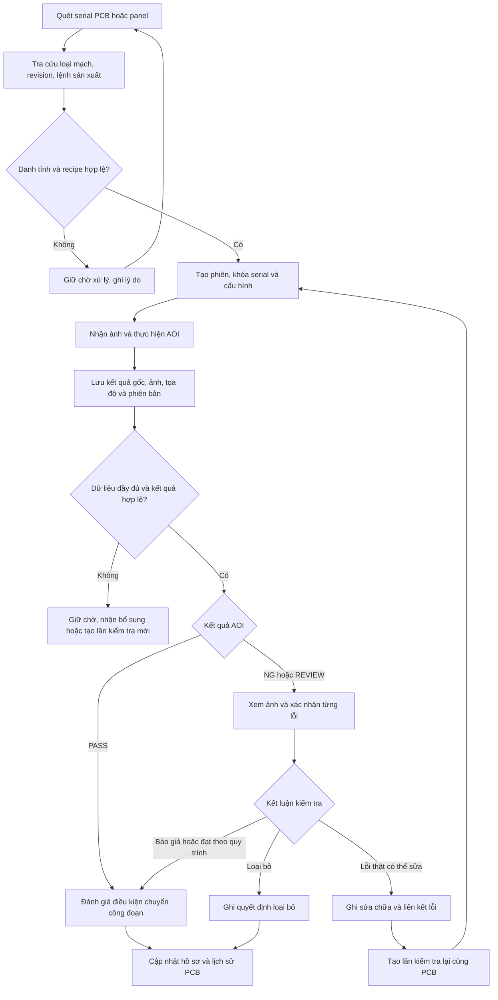

# Kế hoạch số hóa dữ liệu và truy xuất lịch sử kiểm tra PCB cho AOI

> Ngày cập nhật: 2026-09-05  
> Phiên bản: 1.0 — đã rà soát luồng nghiệp vụ và đối chiếu các điểm tích hợp trong repository.  
> Trạng thái: Kế hoạch triển khai; các bảng, dịch vụ và giao diện mới dưới đây là đề xuất, chưa phải tính năng đã hoàn thành.

> **Đã dựng 06/09/2026 — [`aoi_pipeline/storage/`](../../aoi_pipeline/storage/).**
> Lát cắt dọc đầu tiên của giai đoạn 2: schema có phiên bản + migration
> (`schema.py`), repository ghi/đọc một lần kiểm tra kèm vị trí lỗi và ảnh lỗi
> (`repository.py`). SQLite của thư viện chuẩn, SQL thuần, ảnh nằm ngoài CSDL
> trong kho địa chỉ-theo-nội dung. Bốn ràng buộc nghiệp vụ của tài liệu này —
> §8.2 chống trùng theo `event_id`, §6.2 toạ độ luôn kèm hệ quy chiếu, §8.2
> không xoá ảnh còn tham chiếu, §4.4 một mặt đạt không làm cả PCB đạt — đều có
> test riêng. Xem `tests/test_storage.py`.
>
> **Bổ sung 06/09 (migration 2):** `scan_session` — phiên kiểm bo, mỗi trạm một
> phiên đang mở (§4.3), đóng phiên khi còn thiếu mặt thì phải nêu lý do, và kết
> quả về muộn ghi vào đúng phiên sinh ra nó kèm `arrived_after_close`.
>
> **Bổ sung 06/09 (cầu nối):** `storage/bridge.py` dịch `InspectionRun` sang
> `DefectRecord`. Nó cần **cả recipe**, và lý do đáng ghi lại: lỗi quan trọng
> nhất — **thiếu linh kiện** — là lỗi **không có vị trí** trong kết quả chạy
> (`candidate` là `None`, còn `PositionResult` chỉ mang *độ lệch* chứ không mang
> toạ độ tuyệt đối). Vị trí đúng duy nhất cho ca đó là *chỗ linh kiện lẽ ra phải
> nằm*, và chỗ đó chỉ recipe biết. Bỏ qua thì kho vẫn có bản ghi, chỉ là mọi lỗi
> thiếu linh kiện đều không mở được ảnh.
>
> Slot `review` và "không đo được" **cũng vào kho**: bỏ chúng đi thì báo cáo
> "không có lỗi" thành lời nói dối.
>
> Còn thiếu để hết giai đoạn 2: **hàng đợi/retry khi mất mạng** và **đối soát**.
> Xem thêm [ke_hoach_kiem_hai_mat_pcb.md](ke_hoach_kiem_hai_mat_pcb.md) §3 cho
> phần giao diện.

> **Cập nhật 06/09/2026.** Đóng 5 điểm còn hở mà bản rà soát 05/09 nêu: chế độ
> chạy phải nằm trong bản ghi (§9.3, đã cài ở `golden/inspector.py`), quyết định
> đạt hết hiệu lực sau sửa chữa (§9.3), tách "gửi bù" khỏi "sửa payload" (§8.2),
> kết quả đến sau khi phiên đã hủy (§4.3), và không xóa ảnh còn được tham chiếu
> (§8.2).

## 1. Mục tiêu và kết quả rà soát

Xây dựng hồ sơ điện tử cho từng PCB, bắt đầu từ quét serial để xác định loại mạch, tiếp tục qua kiểm tra AOI, lưu ảnh và tọa độ, xác nhận lỗi, sửa chữa và quét lại. Người dùng nhập một serial phải xem được toàn bộ lịch sử cùng bằng chứng của từng lần kiểm tra.

Kế hoạch ban đầu đã đủ luồng chính. Bản này bổ sung các điều kiện cần để triển khai thực tế:

- Gắn serial với đúng phiên kiểm tra, giữ thông tin chương trình thực sự đã chạy.
- Tách PCB vật lý, lần chụp, lần kiểm tra và lần phân tích lại ảnh đã lưu.
- Lưu phiên bản recipe, Golden, model, cấu hình và hiệu chuẩn tại thời điểm kiểm tra.
- Gắn tọa độ với đúng ảnh và hệ quy chiếu; giữ riêng tọa độ phát hiện với số đo độ lệch.
- Tách kết quả thuật toán, tình trạng dữ liệu và quyết định cho phép chuyển công đoạn.
- Đưa chống trùng, phục hồi sau gián đoạn và kiểm tra ảnh vào ngay bản triển khai đầu tiên.
- Bổ sung tiêu chí nghiệm thu có thể kiểm chứng.

**Đơn vị truy xuất gốc là một PCB vật lý. Một PCB có thể có nhiều lần kiểm tra; một lần kiểm tra có nhiều kết quả linh kiện, lỗi và ảnh. Không ghi đè lịch sử khi quét lại.**

Tài liệu này tập trung vào dữ liệu vận hành AOI. Hạng mục dựng hình học/CAD từ ảnh được mô tả riêng trong [Kế hoạch số hóa mạch PCB](ke_hoach_so_hoa_mach_pcb_aoi.md).

## 2. Điểm xuất phát của dự án và phạm vi

### 2.1. Các thành phần đã đối chiếu

Rà soát trên nhánh `main`, commit `ce37c04`; đây là mốc đối chiếu, không phải cam kết rằng toàn bộ hạng mục dưới đây đã tồn tại.

| Thành phần hiện có | Cách sử dụng trong kế hoạch |
|---|---|
| [Ứng dụng và luồng xử lý](../../README.md) | Bổ sung bước nhận diện serial trước khi kiểm tra ảnh; bản đầu có thể tiếp tục dùng upload ảnh |
| [PipelineRun](../../aoi_pipeline/models.py) | Giữ kết quả detection, crop, classification, mối hàn và cấu hình từng lần chạy |
| [Exporter JSON/ZIP](../../aoi_pipeline/reporting/exporters.py) | Tái sử dụng dữ liệu xuất và ảnh làm đầu vào lưu trữ |
| [InspectionRun và AOIInspector](../../aoi_pipeline/golden/inspector.py) | Lưu kết quả alignment, từng slot, position, appearance, recipe/Golden hash và model identifiers |
| [Recipe](../../aoi_pipeline/golden/recipe.py) | Tham chiếu recipe và bộ asset bất biến theo phiên bản |
| [Pipeline bridge](../../app/pipeline_bridge.py) | Truyền ngữ cảnh phiên và kết quả giữa UI với dịch vụ; không tự tính lại kết luận trong UI |

Trong phạm vi các thành phần đã kiểm tra, chưa thấy luồng quản lý serial và lưu lịch sử kiểm tra vào database đáp ứng kế hoạch này. Cần bổ sung lớp lưu trữ quanh core hiện có, đồng thời giữ tương thích các chức năng xuất file.

Thiết kế tọa độ phải tuân theo [Position Check và Golden Compare](../thiet_ke/thiet_ke_position_va_golden_compare.md) cùng [chỉ dẫn repository](../../AGENTS.md). Các mô tả hiện trạng cũ trong tài liệu thiết kế phải được đối chiếu lại với code khi triển khai.

### 2.2. Phạm vi bản đầu

- Một trạm AOI, một nguồn ảnh, board đơn và một mặt kiểm tra đã xác định.
- Danh mục loại PCB/revision và ánh xạ serial có thể nhập nội bộ trước khi có MES.
- Lưu cả lần kiểm tra đạt, lỗi, cần xem xét, không hợp lệ và bị hủy.
- Tra cứu serial, xem ảnh và vùng lỗi, xác nhận lỗi, ghi sửa chữa, liên kết quét lại.
- Kiểm tra đủ dữ liệu, chống nhận trùng, phục hồi cơ bản và sao lưu có thử khôi phục.

Thiết kế sẵn quan hệ cho panel, TOP/BOTTOM, nhiều máy và MES/ERP; triển khai các phần này sau, trừ khi dây chuyền thử nghiệm cần chúng ngay. Hạng mục này không bao gồm thay thuật toán AI, thiết kế camera/ánh sáng hoặc tái tạo CAD/netlist.

## 3. Luồng nghiệp vụ tổng thể

Ảnh thiếu có thể được nhận bổ sung vào lần kiểm tra hiện có. Chụp lại hoặc chạy lại thuật toán phải có bản ghi thực thi mới; không sửa kết quả cũ để biến một lần không hợp lệ thành PASS.

## 4. Nhận diện serial và khóa ngữ cảnh trước khi kiểm tra

### 4.1. Danh mục cần chuẩn bị

| Danh mục | Nội dung tối thiểu |
|---|---|
| Loại mạch | Mã sản phẩm, tên PCB, revision phần cứng, các mặt/công đoạn cần kiểm |
| Recipe | Loại mạch, revision, mặt, phiên bản, hash, trạng thái được phép dùng |
| Serial | Phạm vi duy nhất, định dạng, nguồn cấp mã, quy tắc ánh xạ |
| Sản xuất | Lệnh sản xuất, lot/batch, line; cho phép để trống có lý do ở giai đoạn thử nghiệm |
| Trạm | Mã máy/trạm, nguồn kết quả, định danh người vận hành |
| Hình học | Golden, slot/refdes, hệ tọa độ, kích thước ảnh, profile hiệu chuẩn |

Serial không nhất thiết chứa mã loại mạch. Có thể nhận diện bằng bản ghi đăng ký sẵn, giải mã theo quy tắc hoặc liên kết với lệnh sản xuất. Chọn nguồn ánh xạ có thẩm quyền và thứ tự ưu tiên; khi các nguồn mâu thuẫn phải giữ chờ xử lý.

### 4.2. Quy tắc định danh

1. Mỗi PCB có `pcb_unit_id` nội bộ ổn định; không dùng tên file ảnh làm danh tính.
2. Giữ `serial_raw`, `serial_normalized`, nguồn đọc và phiên bản quy tắc chuẩn hóa. Giữ số 0 đầu; chỉ đổi hoa/thường hoặc bỏ ký tự khi quy tắc đã quy định.
3. Chốt serial duy nhất toàn nhà máy hay theo phạm vi nhà máy/khách hàng. Database đặt ràng buộc duy nhất theo phạm vi đã chốt.
4. Mã đã tồn tại dẫn đến tra cứu PCB cũ và chọn kiểm tra lại, không tự tạo PCB mới.
5. Serial lạ chỉ được đăng ký khi có đủ mã hàng/revision và nguồn xác thực. Không suy ra loại mạch chỉ bằng sự giống nhau của ảnh.
6. Sửa mã đọc nhầm, đổi nhãn hoặc sửa ánh xạ phải ghi người thực hiện, lý do, giá trị trước/sau. Thông tin lịch sử lần kiểm tra giữ nguyên; có sự kiện đính chính khi cần.

### 4.2b. "Serial" thực ra đang hỏi gì

Câu hỏi không phải về định dạng chuỗi, mà là: **lấy gì để phân biệt bo này với
bo kia?** Không có câu trả lời thì hai lần kiểm tra của hai bo khác nhau có thể
bị gộp làm một, và lịch sử mất nghĩa.

Bốn khả năng, xếp từ tốt nhất xuống:

| cách | nghĩa là | dùng được khi |
|---|---|---|
| **Mã vạch / QR in trên bo** | máy quét đọc ra một chuỗi, mỗi bo một chuỗi | bo có sẵn mã — cần xem một bo thật để biết |
| **Số in / khắc trên bo** | người đọc bằng mắt rồi gõ vào | có số nhưng không có mã vạch |
| **Mã dán thêm lúc vào chuyền** | dán nhãn tự sinh trước khi kiểm | bo trắng, không có gì để phân biệt |
| **Không có gì** | đánh số theo thứ tự chạy trong ngày | tạm được cho pilot, nhưng **không truy ngược được** một bo cụ thể sau này |

**Cần xem một bo thật** để trả lời. Ba câu cụ thể khi có bo trong tay:

1. Trên bo có mã vạch/QR không? Nếu có, nó nằm ở mặt nào?
2. Nếu không có mã vạch, có số/chữ nào in hoặc khắc trên bo không?
3. Hai bo cùng loại có phân biệt được với nhau không, hay chúng giống hệt nhau?

Chưa có câu trả lời thì vẫn làm được phần còn lại: bản đầu dùng **ID nội bộ tự
sinh** cho mỗi lần đưa bo vào kiểm, và thay bằng serial thật sau bằng một sự
kiện liên kết — §4.4 đã có sẵn cơ chế đó cho board con trong panel. Nhưng phải
ghi rõ ID nào là tự sinh, để sau này không nhầm nó với serial thật.

### 4.3. Ghép serial với ảnh và lần chạy

- Khi xác định được PCB, tạo `scan_session_id` gắn với trạm, người vận hành, PCB, mặt, công đoạn và recipe dự kiến.
- Trước lúc chạy, khóa ngữ cảnh: mã hàng/revision, recipe thực tế, cấu hình và nguồn ảnh. Đổi serial sau đó phải hủy phiên cũ hoặc mở phiên mới.
- Với upload, gắn ảnh và checksum vào phiên trước khi gọi core. Khi người dùng đổi ảnh, phải vô hiệu kết quả cũ trên UI hoặc tạo phiên mới.
- Với thiết bị có tích hợp, đối chiếu mã chu kỳ/phiên mà máy xác nhận và recipe máy thực sự chạy. Không ghép theo thời điểm gần nhất hoặc serial vừa quét gần nhất.
- Nếu nguồn không hỗ trợ truyền mã phiên, cần quy trình ghép thay thế được kiểm chứng, ví dụ chỉ một board đang hoạt động tại trạm và manifest hoàn tất chứa danh tính. Ghi rõ mức xác thực; chưa đủ bằng chứng thì giữ chờ đối soát.
- Bản đầu chỉ cho một phiên đang chạy trên mỗi trạm. Cần quy tắc timeout, hủy phiên và phục hồi phiên sau khởi động lại.
- **Kết quả đến sau khi phiên đã hủy** thì vẫn ghi vào **đúng phiên đã sinh ra
  nó**, kèm cờ `arrived_after_cancel`. Không hồi sinh phiên đã hủy, và tuyệt đối
  không gán sang phiên đang chạy — hai việc đó đều làm tráo danh tính PCB. Bản
  ghi đó dùng để đối soát, không dùng để ra quyết định công đoạn.

### 4.4. Panel và hai mặt

Nếu quét panel, lưu `panel_id`, bản đồ vị trí và PCB con. Khi board con chưa có serial, dùng ID nội bộ theo panel/vị trí; bổ sung serial sau bằng sự kiện liên kết. Việc tách board khỏi panel phải giữ quan hệ lịch sử.

TOP và BOTTOM thuộc cùng PCB vật lý nhưng có các lần kiểm tra và recipe riêng. Chỉ coi PCB đủ điều kiện khi đã đáp ứng các mặt/công đoạn bắt buộc, không lấy kết quả của một mặt thay cho cả PCB.

## 5. Hồ sơ một lần kiểm tra và quản lý phiên bản

Mỗi lần kiểm tra tạo `inspection_id` riêng và thuộc đúng một `scan_session`. Bản đầu board đơn có một inspection trong mỗi phiên; khi triển khai panel, một phiên có thể chứa các inspection của PCB con. Mỗi lần thực thi lại tạo phiên/inspection mới; retry gửi dữ liệu giữ nguyên ID. Phiên phân tích lại lấy ngữ cảnh từ bản ghi gốc và ghi rõ `reanalysis`.

Ngữ cảnh bất biến của lần kiểm tra gồm:

| Nhóm | Dữ liệu cần lưu |
|---|---|
| Danh tính | PCB, serial tại thời điểm chạy, panel/vị trí nếu có, phiên quét |
| Sản xuất | Mã hàng, revision, lot, lệnh sản xuất, mặt, công đoạn |
| Thực thi | Trạm, người vận hành, nguồn dữ liệu, mã lần chạy tại nguồn, thời gian bắt đầu/kết thúc |
| Phiên bản | Phiên bản ứng dụng/pipeline, schema payload, recipe hash, Golden hash, model identifiers/hash, cấu hình đã dùng |
| Hiệu chuẩn | Profile/hash, hệ tọa độ, transform, chất lượng alignment, trạng thái kiểm chứng metrology |
| Kết quả | Kết quả từng bước, linh kiện/slot/mối hàn, tổng hợp của core và lý do |
| Bằng chứng | Ảnh đầu vào, ảnh dùng để hiển thị tọa độ, ảnh lỗi, file kết quả gốc, manifest checksum |
| Liên kết | Lần kiểm tra trước, sửa chữa liên quan, lý do kiểm tra lại hoặc phân tích lại |

Phân biệt các trường hợp:

- `initial`: kiểm tra PCB lần đầu tại mặt/công đoạn đó.
- `rescan`: chụp/kiểm tra lại PCB, ví dụ sau lần bị hủy hoặc ảnh không đạt.
- `post_repair`: kiểm tra sau một đợt sửa đã ghi nhận.
- `reanalysis`: chạy lại thuật toán trên ảnh cũ; liên kết ảnh và lần gốc, không tính là PCB đã được quét vật lý lần nữa.

Mỗi ảnh đầu vào có định danh lần thu nhận, ví dụ `capture_id`. Một ảnh có thể được phân tích nhiều lần. Kết quả phân tích lại mặc định không thay quyết định sản xuất; muốn sử dụng phải có quy trình xác nhận riêng và giữ quyết định trước đó.

Lưu bản chụp cấu hình hoặc tham chiếu tới phiên bản bất biến. Không chỉ giữ tên recipe/model đang hoạt động vì tên đó có thể trỏ sang nội dung khác sau này. Một hash chỉ giúp định danh; muốn tái phân tích còn phải giữ được artifact và môi trường tương ứng.

## 6. Hợp đồng tọa độ, ảnh và số đo

### 6.1. Những hệ tọa độ cần phân biệt

| Hệ tọa độ | Mục đích và cách lưu |
|---|---|
| Ảnh đầu vào/raw | Tọa độ trên ảnh gốc cùng kích thước và hướng ảnh |
| Ảnh sau xử lý/analysis | Detection/crop của pipeline; gắn đúng ảnh xuất kèm, không mặc định là raw |
| `golden_board_pixels` | Hệ canonical cho kết quả Position/Golden; giữ đúng quy ước core |
| Ảnh crop/ROI | Vị trí cục bộ, có ảnh cha và crop offset/transform khi biết |
| Tọa độ mm | Giá trị theo hiệu chuẩn và hệ trục vật lý được khai báo, kèm trạng thái độ tin cậy |
| Tọa độ model | Dữ liệu nội bộ sau resize/letterbox; không dùng trực tiếp làm số đo vật lý |

Mỗi vùng đánh dấu cần có `image_id`, `coordinate_space`, kích thước ảnh và hình học. Với một lỗi có nhiều ảnh, lưu vùng đánh dấu riêng cho từng ảnh trong `defect_images`.

### 6.2. Quy ước bắt buộc

- Bbox dùng `xyxy = [x_min, y_min, x_max, y_max]`, biên phải/dưới exclusive như core hiện tại. Kiểm tra `0 <= x_min < x_max <= width` và tương tự cho Y.
- Khai báo gốc tọa độ, chiều trục, đơn vị, xoay/lật và mặt PCB. Với ảnh pixel dùng quy ước gốc trên trái, X sang phải, Y xuống dưới; mọi hệ nguồn khác phải ghi rõ.
- Giữ bbox/tọa độ nguồn và kết quả chuyển đổi nếu có. Nếu clamp vào biên hoặc từ chối hình học, ghi lý do; không âm thầm mất dữ liệu nguồn.
- Lưu chuỗi chuyển đổi raw → undistorted → aligned → crop; ghi chiều biến đổi, tham số và phiên bản. Khử méo lens có thể cần profile/mapping riêng, không giả định mọi bước chỉ là một ma trận affine.
- Zoom/scroll/xoay trên UI chỉ biến đổi cách hiển thị, không sửa tọa độ lưu.
- Khi không biết phép biến đổi, chỉ đánh dấu trên ảnh có tọa độ xác định. Không tự suy đoán vị trí trên ảnh toàn PCB từ một crop rời.
- Golden/template/mask phục vụ đo và so sánh giữ lossless. Crop đã resize/letterbox để phân loại không dùng để đo vị trí.

### 6.3. Tách vị trí lỗi và độ lệch linh kiện

- Vị trí lỗi: điểm, bbox hoặc polygon cho biết vùng cần xem trên một ảnh.
- Vị trí chuẩn: slot/refdes, expected center/angle và fixed ROI trong recipe.
- Số đo lệch: `dx_px`, `dy_px`, `dx_mm`, `dy_mm`, góc, score, tolerance và kết quả chất lượng của core.

Không dùng tâm detection bbox thay cho kết quả đo Position Check. Giữ riêng alignment status, position status, appearance status và board status.

Khi alignment không đạt, production inspection phải dừng với kết quả không hợp lệ theo core. Không đổi `INVALID`, `unmeasurable`, `missing_candidate` thành PASS; số đo không hợp lệ để `null` cùng lý do. Nếu core trả số mm trong chế độ demo/chưa kiểm chứng, giữ nguyên kết quả nguồn nhưng phải hiển thị trạng thái chưa kiểm chứng và không dùng làm bằng chứng đạt production.

### 6.4. Lưu cả kết quả đạt

Ngoài danh sách lỗi, cần lưu kết quả các slot/phép kiểm đã thực hiện, gồm PASS và trạng thái bỏ qua/chưa đo nếu có. Một lần không có dòng lỗi chưa đủ chứng minh toàn bộ PCB đã được kiểm tra.

Lưu danh sách bước/phép kiểm bắt buộc theo cấu hình và coverage thực tế. Ngưỡng confidence của detector hoặc kết quả phân loại family `accept` không tự đồng nghĩa PCB đạt chất lượng.

## 7. Lưu trữ database và kho ảnh

### 7.1. Phân chia dữ liệu

- Database lưu metadata, quan hệ, tọa độ, số đo, kết luận, sự kiện và thông tin tệp.
- Kho tệp/object storage lưu ảnh, kết quả gốc, recipe/assets và artifact cần giữ. Bản đầu có thể dùng kho tệp do dịch vụ quản lý; tách giao diện lưu tệp để chuyển kho sau.
- Database giữ `storage_key` tương đối/định danh đối tượng, checksum, dung lượng, loại tệp và trạng thái. Không xuất đường dẫn tuyệt đối của máy trạm.
- Giữ nguyên ảnh gốc và render overlay từ dữ liệu. Ảnh có khung lỗi/thumbnail là bản dẫn xuất, có thể tạo lại.

Việc chọn hệ quản trị database chốt sau khi biết số trạm, số người truy cập đồng thời và mô hình triển khai. Bản thiết kế logic không phụ thuộc một sản phẩm cụ thể.

### 7.2. Mô hình dữ liệu logic đề xuất

| Bảng/nhóm | Nội dung và ràng buộc chính |
|---|---|
| `pcb_models`, `pcb_revisions` | Mã hàng, revision, các mặt/công đoạn yêu cầu |
| `recipe_versions` | Phiên bản bất biến, hash, asset references, điều kiện áp dụng |
| `serial_mapping_rules` | Quy tắc ánh xạ có phiên bản và nguồn |
| `production_orders` | Lệnh sản xuất, lot, loại PCB |
| `pcb_units`, `serial_events` | PCB vật lý, danh tính hiện tại và lịch sử sửa/gán serial |
| `panels`, `panel_members` | Panel, PCB con, vị trí và lịch sử liên kết nếu dùng |
| `scan_sessions` | Phiên nhận diện, trạm, ngữ cảnh khóa, thời hạn và trạng thái |
| `captures` | Lần thu nhận ảnh, nguồn và thời điểm; liên kết ảnh đầu vào |
| `inspections` | Một lần kiểm tra một PCB/mặt/công đoạn, snapshot cấu hình, kiểu chạy và kết quả |
| `inspection_captures` | Liên kết lần kiểm tra với một/nhiều ảnh thu nhận; hỗ trợ tái phân tích |
| `inspection_results` | Từng slot/linh kiện/mối hàn/phép kiểm, số đo và trạng thái kể cả đạt |
| `defects` | Phát hiện cần xử lý; loại lỗi gốc/chuẩn hóa, đối tượng, mức độ và lý do |
| `images`, `defect_images` | Metadata ảnh; liên kết lỗi–ảnh cùng vùng đánh dấu trong hệ ảnh đó |
| `reviews` | Quyết định xác nhận từng lỗi, tác giả, thời điểm, lý do, quyết định bị thay thế nếu có |
| `repairs`, `repair_items` | Đợt sửa và từng lỗi được xử lý; liên kết lần kiểm tra xác minh |
| `quality_decisions` | Quyết định tại công đoạn, bằng chứng, phiên bản quy tắc và người/dịch vụ quyết định |
| `ingestion_events` | Mã sự kiện nguồn, checksum, schema, retry, trạng thái và lỗi nhận dữ liệu |
| `audit_events` | Lịch sử thao tác quản trị, sửa ánh xạ, review và quyết định |

Nếu nguồn xuất cả panel trong một chu kỳ, bổ sung `machine_runs` để nhóm các `inspections`. Nếu không dùng panel, chưa cần triển khai phần này trong bản đầu.

Event của cả panel được chống trùng ở cấp `ingestion_event`/`machine_run` và có thể sinh nhiều inspection PCB con. Trong mỗi lần chạy đặt khóa duy nhất theo `(machine_run_id, pcb_unit_id, side, stage)`; không áp khóa một event chỉ được có một inspection. Retry một phần phải bổ sung được PCB con còn thiếu mà không nhân đôi kết quả đã nhận.

Đây là mô hình logic, không bắt buộc mỗi hàng trong bảng trên tương ứng đúng một bảng vật lý ngay từ đầu. Các quan hệ danh tính, lần kiểm tra, ảnh và quyết định cần khóa ngoại; không gom toàn bộ vào một JSON duy nhất rồi chỉ tìm bằng tên file.

### 7.3. Ràng buộc và chỉ mục

- Khóa duy nhất cho `(serial_namespace, serial_normalized)` theo quy tắc đã chốt.
- Khóa chống nhận trùng theo `(source_id, source_event_id)`; với máy reset bộ đếm cần thêm định danh phiên khởi động/lô phát sự kiện.
- Mã kiểm tra lại do hệ thống cấp mới; cùng serial, cùng ảnh hoặc cùng checksum không đủ để coi hai lần chạy là một.
- Khóa duy nhất kết quả nguồn trong phạm vi inspection khi nguồn cung cấp ID; ID detection ngẫu nhiên không dùng làm định danh linh kiện xuyên lịch sử.
- Chỉ mục cho PCB/thời gian, mã hàng/revision/thời gian, trạm/thời gian, loại lỗi/trạng thái xử lý.
- Kết quả nguồn và snapshot giữ bất biến. Quyết định thay đổi bằng sự kiện mới; trạng thái hiện tại có thể là bản tổng hợp từ lịch sử.

### 7.4. Dung lượng, thời gian lưu và khôi phục

Ước tính: `dung lượng/ngày = số lần kiểm tra/ngày × dung lượng ảnh trung bình/lần + artifact phát sinh`. Tính riêng ảnh đạt, ảnh lỗi, quét lại, thumbnail và bản sao lưu; không chỉ nhân số PCB với một ảnh.

Chốt thời gian giữ ảnh và metadata trước pilot. Bản đầu chưa tự xóa lịch sử; khi áp dụng retention phải có trạng thái `archived`/`expired`, mốc hết hạn và ngoại lệ giữ ảnh theo vụ việc. Giao diện phân biệt ảnh hết hạn theo chính sách với ảnh thất lạc.

Sao lưu cả database và kho tệp theo manifest nhất quán. Nghiệm thu bằng phục hồi thử trên thư mục/môi trường khác, tìm được serial và mở đúng ảnh. Chốt mức mất dữ liệu chấp nhận được và thời gian phục hồi mục tiêu theo nhu cầu vận hành.

## 8. Nhận dữ liệu, đồng bộ và phục hồi

### 8.1. Luồng ghi đề xuất

1. Tạo phiên và inspection ID trước khi thực thi; lưu ngữ cảnh đủ để phục hồi.
2. Nhận payload/ảnh vào vùng tạm và hàng đợi bền vững. Với file từ máy, chỉ nhận khi có tín hiệu hoàn tất/rename/manifest; kiểm tra kích thước ổn định chỉ là phương án thay thế cần kiểm chứng.
3. Kiểm tra schema, danh tính, mã phiên, recipe thực tế, danh sách ảnh dự kiến và checksum. Giữ payload gốc cùng phiên bản bộ chuyển đổi.
4. Ghi metadata và các kết quả có thể truy vấn, đánh dấu dữ liệu chưa hoàn tất.
5. Đưa tệp vào kho đích theo khóa ổn định; retry dùng lại khóa, kiểm tra tệp đọc được và checksum.
6. Trong transaction database, hoàn tất liên kết ảnh/kết quả và đánh dấu `complete` khi đã đủ các bằng chứng bắt buộc.
7. Ghi xác nhận đã nhận bền vững để nguồn/hàng đợi biết có thể giải phóng bản cục bộ theo chính sách.
8. Chạy đối soát định kỳ để phát hiện ảnh mồ côi, metadata thiếu ảnh và các phiên bị treo.

Database và kho tệp không mặc định có cùng một transaction. Vì vậy cần trạng thái trung gian và retry có thể chạy lại an toàn. Nguồn gửi có thể lặp; mục tiêu là một bản ghi nghiệp vụ hợp lệ cho cùng sự kiện nguồn.

### 8.2. Các tình huống phải xử lý

| Tình huống | Hành vi yêu cầu |
|---|---|
| Mất mạng giữa lúc gửi | Hàng đợi và ảnh còn nguyên sau restart; tiếp tục gửi phần chưa xác nhận |
| Gửi lại cùng event, cùng nội dung | Trả kết quả tiếp nhận cũ, không thêm inspection/lỗi mới |
| Cùng event, **bổ sung phần còn thiếu** (ví dụ ảnh chưa gửi kịp) | Nhận thêm, giữ nguyên phần đã nhận; đây **không** phải xung đột |
| Cùng event, **sửa phần đã nhận** | Ghi xung đột và giữ chờ; không ghi đè âm thầm |
| Ảnh còn ghi dở/thiếu/hỏng | Chưa `complete`; retry hoặc đưa vào danh sách cần xử lý |
| Sai serial/recipe | Giữ chờ đối soát, không tự sửa danh mục để hợp thức hóa |
| Lỗi ứng dụng, máy dừng, hủy giữa chừng | Giữ bản ghi lần chạy và nguyên nhân; phiên mới có ID mới |
| Đầy ổ đĩa/hàng đợi | Cảnh báo trước ngưỡng; không thông báo lưu thành công khi chưa ghi bền vững |
| Kết quả đến sai thứ tự | Sắp theo liên kết phiên/lần chạy và thời gian nguồn; không lấy thứ tự nhận làm thứ tự sản xuất |
| Sai giờ máy | Giữ thời gian nguồn, múi giờ và thời gian nhận UTC để đối soát |
| Xóa/hết hạn ảnh còn được tham chiếu | Không xóa khi còn lần phân tích khác trỏ tới (ảnh gốc dùng chung, ảnh Golden); đếm tham chiếu trước khi thu hồi |

Hai dòng đầu bảng trên **phải tách bạch trong code**, không gộp thành một
phép so sánh payload: "gửi thiếu rồi gửi bù" là luồng bình thường, còn "gửi rồi
sửa" là xung đột. Gộp lại thì hoặc chặn oan dữ liệu bổ sung hợp lệ, hoặc cho ghi
đè âm thầm — cả hai đều hỏng.

Chính sách offline phải được chốt trước pilot: chỉ tiếp tục nhận PCB khi xác minh được danh tính/recipe và còn khả năng ghi bền vững cục bộ; nếu không thì giữ chờ. Với máy độc lập, việc dừng máy tự động phụ thuộc giao diện tích hợp thực tế; không tuyên bố có interlock nếu chưa triển khai và kiểm chứng.

## 9. Trạng thái, xác nhận lỗi và sửa chữa

### 9.1. Tách các loại trạng thái

| Nhóm | Giá trị đề xuất | Ý nghĩa |
|---|---|---|
| Phiên/thực thi | `prepared`, `running`, `finished`, `aborted`, `error` | Tiến trình chạy |
| Tính đầy đủ dữ liệu | `pending`, `partial`, `complete`, `conflict`, `failed` | Đã nhận đủ bằng chứng theo hợp đồng hay chưa |
| Kết quả AOI chuẩn hóa | `PASS`, `NG`, `REVIEW`, `INVALID` hoặc chưa có kết quả | Giữ thêm giá trị/lý do gốc của core; mapping có phiên bản |
| Review từng lỗi | `pending`, `confirmed`, `false_call`, `needs_more_evidence` | Kết luận của người kiểm tra |
| Quyết định công đoạn | `hold`, `accepted`, `rework_required`, `scrapped` | Hành động tiếp theo với PCB |

Một lần `INVALID` hoặc bị hủy vẫn có thể `complete` về dữ liệu nếu đã lưu đủ ảnh/payload/log bắt buộc cho trạng thái đó. Ngược lại, kết quả máy PASS nhưng thiếu ảnh bắt buộc vẫn là `partial` và chưa đủ điều kiện chuyển công đoạn.

### 9.2. Xác nhận và sửa chữa

1. Nhân viên mở lỗi để xem ảnh, vị trí, số đo, ảnh chuẩn và kết quả từng bước.
2. Xác nhận lỗi thật, báo giả hoặc cần thêm bằng chứng; lưu người, thời gian, lý do và các ảnh tham chiếu.
3. Nếu lỗi thật có thể sửa, tạo đợt sửa và liên kết cụ thể từng lỗi; ghi thao tác, linh kiện thay thế nếu cần.
4. Tạo kiểm tra sau sửa, liên kết với đợt sửa và lần lỗi gốc.
5. Giữ kết quả AOI gốc kể cả khi người kiểm tra kết luận báo giả. Đổi quyết định review tạo phiên bản/sự kiện mới.

Mỗi lần kiểm tra tạo ID lỗi mới. Muốn đối chiếu lỗi còn/hết qua các lần chạy, dùng PCB, mặt, slot/refdes/pin hoặc vùng kiểm, loại lỗi và phiên bản recipe. Nếu recipe đổi slot hoặc không có ID ổn định, cần ánh xạ được xác nhận; chỉ gần nhau về tọa độ chưa đủ kết luận là cùng lỗi.

### 9.3. Điều kiện chấp nhận tại công đoạn

Quyết định được thực hiện bởi dịch vụ nghiệp vụ theo quy tắc có phiên bản, với tối thiểu:

- Danh tính PCB và recipe đúng, kết quả thuộc chế độ được phép dùng cho sản xuất.
  **Chế độ chạy phải nằm ngay trong bản ghi**, không suy từ cấu hình lúc đọc:
  `production_gates_enforced` và `production_gate_findings` (những cổng lẽ ra đã
  chặn, đánh giá bất kể cờ). Thiếu hai trường này thì một lần chạy thử và một lần
  chạy thật trông giống hệt nhau. *(Đã cài ở `golden/inspector.py`, 06/09.)*
- Dữ liệu/bằng chứng bắt buộc đầy đủ; tất cả mặt và phép kiểm bắt buộc có kết quả hợp lệ.
- Không còn lỗi thật chưa xử lý hoặc yêu cầu review chưa giải quyết.
- Sau sửa đã có bằng chứng xác minh phù hợp với quy trình.
- Người/dịch vụ ra quyết định có quyền và ghi rõ các inspection làm căn cứ.

**Một quyết định đạt HẾT HIỆU LỰC khi PCB bị can thiệp vật lý.** Cụ thể: sau
mỗi lần sửa chữa hoặc thao tác làm đổi trạng thái bo, quyết định đạt trước đó
không còn dùng để chuyển công đoạn được nữa — phải có lần kiểm tra hợp lệ mới.
Bản ghi cũ **vẫn giữ nguyên** trong lịch sử (nó là bằng chứng của thời điểm đó),
chỉ mất quyền làm căn cứ. Hai chuyện này khác nhau và không được cài lẫn: xóa
lịch sử là mất dấu vết, còn giữ hiệu lực là cho qua một bo đã bị đụng vào.

Không dùng quy tắc đơn giản “lần đến sau cùng là PASS thì PCB đạt”. Các lần quét không hợp lệ, phân tích lại ảnh hoặc kết quả chỉ của một mặt không thay thế quyết định hợp lệ trước đó; kết quả bất lợi mới phải kích hoạt giữ chờ/đánh giá lại theo quy trình.

### 9.4. Quyền thao tác

- Vận hành: nhận serial, bắt đầu/hủy phiên theo quyền, xem kết quả.
- Kiểm tra chất lượng: review lỗi và ra quyết định được phân công.
- Sửa chữa: ghi thao tác sửa, không sửa kết quả máy.
- Kỹ thuật: quản lý loại mạch, recipe và ánh xạ serial theo quyền.
- Quản trị: quản lý tài khoản, lưu trữ, sao lưu và cấu hình hệ thống.

Ghi audit cho thay đổi danh tính, recipe, review, sửa chữa và quyết định. Khi hai người sửa cùng quyết định, kiểm tra phiên bản để tránh người lưu sau âm thầm ghi đè người trước.

## 10. Tra cứu, xem ảnh và báo cáo

### 10.1. Các màn hình cần có

| Màn hình | Nội dung chính |
|---|---|
| Nhận diện PCB | Serial, mã hàng, revision, mặt, lot, recipe, lý do giữ chờ |
| Lịch sử PCB | Timeline các lần kiểm tra, review, sửa chữa, quyết định và liên kết panel |
| Chi tiết lần kiểm tra | Thời gian, phiên bản, kết quả từng bước, coverage và tình trạng đủ dữ liệu |
| Xem lỗi | Ảnh tổng/crop, overlay, zoom, danh sách lỗi, slot/refdes, số đo và thao tác review |
| So sánh lần kiểm tra | Ảnh trước/sau sửa, vị trí tương ứng khi có mapping đáng tin cậy |
| Theo dõi tiếp nhận | Các phiên treo, ảnh thiếu, xung đột serial/event, retry và dung lượng |

Tìm theo serial là đường truy xuất chính; thêm bộ lọc mã hàng, revision, lot/lệnh sản xuất, khoảng thời gian, trạm, loại lỗi và trạng thái. Kết quả phân trang; ảnh tải thumbnail trước rồi tải ảnh gốc khi cần.

Ví dụ lịch sử cần thể hiện được: `PCB A → lần 1 NG tại R12 → xác nhận lệch → sửa R12 → lần 2 PASS → quyết định đạt`, trong khi lần 1 vẫn mở đúng ảnh và số đo cũ.

### 10.2. Chỉ số sau khi dữ liệu ổn định

- Tỷ lệ đạt lần đầu theo PCB/mặt/công đoạn, không tính phân tích lại và quét sau sửa vào mẫu số của lần đầu.
- Tỷ lệ NG của máy theo số lần kiểm tra hợp lệ; báo riêng INVALID/ABORTED và dữ liệu thiếu.
- Tỷ lệ báo giả trên các phát hiện đã được review, kèm tỷ lệ bao phủ review.
- Lỗi thường gặp theo mã hàng, revision, vị trí, recipe/model và trạm.
- Số PCB cần sửa, số lần sửa, thời gian chờ review và thời gian xử lý.

Lưu định nghĩa/mẫu số của từng báo cáo. Báo cáo xuất phải có bộ lọc và thời điểm tạo để người đọc hiểu phạm vi số liệu.

## 11. Lộ trình và đầu ra từng giai đoạn

Triển khai theo thứ tự hợp đồng dữ liệu → lưu trữ và phục hồi → tích hợp core → giao diện. Chưa ấn định lịch theo tuần khi chưa có sản lượng, dữ liệu mẫu và nhân lực.

| Giai đoạn | Công việc | Đầu ra/điều kiện chuyển bước |
|---|---|---|
| 0. Chốt quy trình | Lấy mẫu PASS/NG/INVALID/quét lại; xác định serial, nguồn ảnh và recipe | Từ điển dữ liệu, bảng ánh xạ trạng thái, bộ dữ liệu nghiệm thu và danh sách quyết định còn mở |
| 1. Contract và định danh | Thiết kế phiên, PCB, inspection, snapshot, tọa độ, khóa chống trùng | Schema có phiên bản, ERD và mẫu payload; chứng minh hai PCB liên tiếp không tráo ngữ cảnh |
| 2. Lưu trữ bền vững | Migration DB, repository/service, kho ảnh, queue, retry, đối soát | Ghi/đọc lại được một inspection đầy đủ; phục hồi gián đoạn, không tạo trùng, mở đúng ảnh |
| 3. Tích hợp một trạm | Bọc core hiện có, giữ JSON/ZIP và lưu runtime versions | Lưu cả PASS/NG/REVIEW/INVALID/hủy; không mất các trạng thái và số đo của core |
| 4. Tra cứu và xử lý lỗi | UI serial, timeline, viewer, review, repair, quyết định công đoạn | Đi trọn vòng đời PCB lỗi → sửa → kiểm tra lại, có quyền và audit |
| 5. Pilot | Dữ liệu thực, hiệu năng, offline, đầy đĩa, sao lưu và khôi phục | Qua tiêu chí nghiệm thu; có hướng dẫn vận hành và xử lý sự cố |
| 6. Mở rộng | Panel/hai mặt nếu chưa làm, nhiều trạm, MES/ERP, dashboard và retention tự động | Kiểm chứng lại ràng buộc danh tính và đồng thời ở quy mô mới |

Các trách nhiệm cần phân công: vận hành xác nhận luồng thực tế; kỹ thuật cung cấp recipe/định dạng kết quả; chất lượng chốt cách review và chuyển công đoạn; phát triển triển khai contract/lưu trữ/UI; người vận hành hệ thống chốt dung lượng và phục hồi. Một người có thể kiêm nhiệm ở giai đoạn thử nghiệm.

Không đợi giai đoạn mở rộng mới thêm chống trùng hoặc xử lý dữ liệu thiếu. Nếu pilot dùng panel/hai mặt thì kéo các phần bắt buộc đó vào contract và tích hợp ban đầu.

## 12. Tiêu chí nghiệm thu

Các mục dưới đây là kiểm thử cần thực hiện khi triển khai; việc lập tài liệu chưa chứng minh hệ thống đã đáp ứng.

| Mã | Kịch bản | Kết quả mong đợi |
|---|---|---|
| AC01 | Serial đúng, lạ, trùng, có số 0 đầu hoặc ánh xạ mâu thuẫn | Đúng PCB/loại/revision; các trường hợp không xác định bị giữ chờ và có lý do |
| AC02 | Quét A rồi B, đổi ảnh trên UI hoặc hủy phiên A | Không tráo serial, ảnh hoặc kết quả giữa các phiên |
| AC03 | Recipe thực tế khác dự kiến, recipe/model đổi phiên bản | Phát hiện sai lệch; lần cũ vẫn đọc đúng snapshot và asset references |
| AC04 | PASS, NG, REVIEW, alignment INVALID, lỗi và hủy giữa chừng | Giữ đúng trạng thái nguồn, trạng thái dữ liệu và lịch sử |
| AC05 | PCB không có lỗi nhưng thiếu phép kiểm bắt buộc | Không tự quyết định đạt do danh sách lỗi rỗng |
| AC06 | Chọn lỗi trên ảnh tổng/crop, zoom, xoay, biên ảnh | Overlay đúng ảnh và vùng theo contract; thiếu transform không hiển thị vị trí suy đoán |
| AC07 | Raw khác analysis, có undistort/align; mm chưa kiểm chứng | Hiển thị đúng hệ quy chiếu; không biến bbox hoặc số demo thành số đo production |
| AC08 | Sửa một lỗi rồi quét lại; chạy reanalysis trên ảnh cũ | Giữ cả hai kết quả, liên kết sửa đúng; reanalysis không tự thay quyết định sản xuất |
| AC09 | Gửi lại cùng event nhiều lần, cùng ID khác payload | Một kết quả cho sự kiện trùng; payload xung đột bị giữ chờ |
| AC10 | Mất mạng/restart tại các bước ghi DB và ảnh | Queue phục hồi, không mất bản đã xác nhận, tiếp tục hoàn tất được dữ liệu còn thiếu |
| AC11 | Ảnh thiếu, hỏng, còn ghi dở hoặc đầy ổ đĩa | Không báo lưu hoàn tất sai; có cảnh báo và đường xử lý rõ |
| AC12 | Hai người review đồng thời hoặc thao tác sai quyền | Không ghi đè âm thầm; thao tác bị chặn theo quyền và có audit cần thiết |
| AC13 | Panel/TOP/BOTTOM nếu triển khai | Đúng PCB con/mặt, đủ điều kiện mọi phần bắt buộc mới quyết định đạt |
| AC14 | Khôi phục DB và ảnh sang môi trường thử | Tra serial, mở ảnh, đọc quyết định và kiểm tra checksum thành công |
| AC15 | Kiểm tra lại nhiều lần rồi chạy báo cáo | Số PCB, số lần kiểm tra và tỷ lệ lần đầu không bị trộn mẫu số |

Ngưỡng thời gian tra cứu, tải ảnh, độ lớn queue và dung lượng phải chốt ở giai đoạn 0 rồi đo ở pilot với tải đại diện. Kiểm tra tọa độ hiển thị bằng ảnh mẫu có điểm/vùng biết trước; nếu công bố độ chính xác mm phải có kiểm chứng vật lý riêng, không chỉ test tổng hợp.

## 13. Các quyết định cần chốt trước triển khai

| Chủ đề | Đề xuất khởi đầu | Thông tin cần xác nhận |
|---|---|---|
| Nguồn kiểm tra | Tích hợp pipeline local và upload hiện có | ✅ **06/09: bên kĩ thuật đang làm phần cứng.** Nguồn là máy của chính dự án, chưa có. ⇒ bản đầu đi qua pipeline local; chừa sẵn khe tích hợp, **không** thiết kế quanh API của một máy chưa tồn tại |
| Serial | Đọc barcode/QR thành chuỗi và tra danh mục | ⏳ **Đang hỏi lại cho dễ hiểu.** Câu hỏi thực chất: *lấy gì để phân biệt bo này với bo kia?* Xem §4.2b |
| Recipe | Khóa phiên bản theo mã hàng/revision/mặt | Có xác minh được recipe thực sự chạy ở nguồn không? |
| PCB/panel | Bản đầu board đơn nếu pilot cho phép | ✅ **06/09: CÓ hai mặt.** ⇒ TOP/BOTTOM vào contract **ngay từ đầu**, không hoãn sang giai đoạn mở rộng (§4.4). Panel và serial con vẫn chưa rõ |
| Chất lượng | Giữ riêng kết quả core và quyết định công đoạn | Phép kiểm bắt buộc, xử lý báo giả, xác minh sau sửa, người có quyền |
| Lưu trữ | DB metadata + kho ảnh do dịch vụ quản lý | ✅ **06/09: yêu cầu tối thiểu là lưu VỊ TRÍ lỗi kèm ẢNH lỗi.** ⇒ ảnh crop theo lỗi là bắt buộc; ảnh toàn bo giữ hay không còn tuỳ dung lượng. ⏳ Sản lượng, số trạm, thời gian giữ **vẫn chưa có** — chưa chốt được dung lượng và chính sách thu hồi |
| Gián đoạn | Chỉ tiếp tục khi giữ được danh tính và ghi bền vững | Giới hạn offline, hành vi khi đầy đĩa, khả năng dừng/giữ PCB thực tế |
| Dữ liệu cũ | Import có gắn nguồn và đánh dấu thông tin thiếu | Có kết quả cũ cần nhập không, có serial/recipe/ảnh đủ để ghép không? |

Khi nhập lịch sử cũ, không tự bịa serial hoặc trạng thái PASS. Gói thiếu danh tính đưa vào khu đối soát; thời điểm nhập và thời điểm kiểm tra gốc được lưu riêng.

Phạm vi đủ để bắt đầu triển khai là: chốt dữ liệu mẫu và định danh phiên, sau đó xây một luồng hoàn chỉnh cho một PCB từ serial tới lần kiểm tra đã lưu và mở lại được ảnh. Review, sửa chữa và quyết định công đoạn hoàn thiện tiếp trên cùng nền dữ liệu đó trước khi đưa vào vận hành pilot.
