# Kế hoạch Nghiên cứu & Ứng dụng RNN / LSTM vào Hệ thống AOI PCB

> Phiên bản kế hoạch: `v1.0` — 2026-08-21  
> Trạng thái: Nghiên cứu R&D & Thiết kế Kiến trúc Tích hợp  
> Phạm vi áp dụng: Bước 5.5 (Chuỗi chân linh kiện), Bước 6.2 (Phân loại lỗi mối hàn đa góc), Bước 7 (Giám sát chuỗi thời gian SMT)  
> Tài liệu liên quan: [Kế hoạch phân loại linh kiện 6.1](ke_hoach_pretrain_6_1_classification.md) | [Detect mối hàn 2 giai đoạn](ke_hoach_detect_moi_han_2_giai_doan.md) | [Kế hoạch số hóa mạch PCB](ke_hoach_so_hoa_mach_pcb_aoi.md) | [Báo cáo tiến độ](../bao_cao/bao_cao_tien_do.md)

---

## 1. Tổng quan & Tính Cần thiết

Trong hệ thống AOI PCB hiện tại, các mô hình 2D CNN (như MobileNetV3, ConvNeXt) và YOLO xử lý từng ảnh đơn lẻ tại một thời điểm độc lập (Spatial 2D). Tuy nhiên, trên dây chuyền sản xuất thực tế, nhiều dạng khuyết tật và đặc tính vật lý của bo mạch PCB mang bản chất **dữ liệu dạng chuỗi (Sequential / Temporal Data)**:

1. **Chuỗi chân pin linh kiện (Spatial Sequence):** Các IC (QFP, SOP, TSSOP) và đầu nối (Connector) gồm hàng chục đến hàng trăm chân được xếp thẳng hàng với chu kỳ pitch cố định. Hiện tượng cẩu thiếc (*solder bridge*), lệch bước (*pitch drift*) hoặc cong chân luôn mang tính phụ thuộc không gian giữa các chân liền kề $Pin_{i-1} \leftrightarrow Pin_i \leftrightarrow Pin_{i+1}$.
2. **Chuỗi góc chiếu sáng (Photometric Lighting Sequence):** Mối hàn là bề mặt kim loại dạng gương có độ cong mặt khum (*meniscus*). Khi chiếu sáng lần lượt từ các góc khác nhau (Top $\to$ High Angle $\to$ Low Angle $\to$ Coaxial), hướng phản xạ phản ánh trực tiếp chất lượng liên kết hàn (hàn nguội, thiếu thiếc, nứt thiếc).
3. **Chuỗi khung hình thời gian thực (Temporal Video Stream):** Bo mạch di chuyển trên băng chuyền qua cụm camera tạo ra chuỗi 3–5 frames liên tiếp. Việc tổng hợp chuỗi thời gian giúp khử nhiễu lóa sáng và chống báo động giả (*False Call*).
4. **Chuỗi chỉ số suy thoái SMT (Process Telemetry Time-Series):** Các sai số tọa độ ($dx, dy, d\theta$) và độ dày kem hàn qua từng mẻ sản xuất là chuỗi thời gian dùng để dự báo bảo trì sớm (*Predictive Maintenance*).

**Mục tiêu:** Ứng dụng mạng hồi quy **RNN / LSTM / BiLSTM** kết hợp với trích xuất đặc trưng 2D CNN (mô hình lai **CNN-LSTM**) nhằm tăng độ chính xác phân loại lỗi, giảm tỷ lệ lọt lỗi (*Escape Rate*) và hạn chế tối đa báo ảo (*False Call*).

---

## 2. Bốn Kịch bản Ứng dụng Chi tiết

```mermaid
flowchart TD
    subgraph S1["Kịch bản 1: Chiếu sáng Đa góc (Multi-Lighting Angle)"]
        A1["Chuỗi T ảnh góc chiếu [Top, High, Low, Coaxial]"] --> B1["2D CNN trích xuất vector đặc trưng"]
        B1 --> C1["LSTM học động học phản xạ mặt khum"]
        C1 --> D1["Phát hiện: Cold joint, Lifted lead, Insufficient"]
    end

    subgraph S2["Kịch bản 2: Chuỗi Chân hàn IC (Lead Sequence Modeling)"]
        A2["Chuỗi N ROI chân IC [Pin_1, Pin_2, ..., Pin_N]"] --> B2["CNN Backbone + Positional Encoding"]
        B2 --> C2["BiLSTM 2 chiều quét tương quan lân cận"]
        C2 --> D2["Phát hiện: Solder bridge, Pin skew, Bent lead"]
    end

    subgraph S3["Kịch bản 3: Tích hợp Khung hình Băng chuyền (Temporal Stream)"]
        A3["Chuỗi Frame video liên tiếp từ Camera"] --> B3["Frame-level Feature Extractor"]
        B3 --> C3["ConvLSTM / Recurrent Cell tổng hợp thời gian"]
        C3 --> D3["Khử nhiễu lóa sáng, ổn định verdict PASS/NG"]
    end

    subgraph S4["Kịch bản 4: Dự báo Suy thoái Dây chuyền SMT (Telemetry Drift)"]
        A4["Chuỗi đo lường (dx, dy, dθ, paste volume) qua thời gian"] --> B4["Sequence Normalization"]
        B4 --> C4["LSTM Time-Series Regressor"]
        C4 --> D4["Cảnh báo: Lệch nozzle, biến chất kem hàn, nghẹt kim"]
    end
```



---

### 2.1 Kịch bản 1: Phân loại Lỗi Mối hàn qua Chuỗi Chiếu sáng Đa góc (Photometric Multi-Angle Sequence)

* **Vấn đề thực tế:** 1 ảnh 2D tĩnh đơn lẻ rất dễ nhầm lẫn giữa ánh kim loại chuẩn và hiện tượng chói sáng cục bộ (specular glare), hoặc không thấy được chân IC bị nhấc nhẹ (*lifted lead*).
* **Kiến trúc mô hình (CNN-LSTM):**
  - **Input:** Chuỗi $T=4$ ảnh của cùng 1 mối hàn: $X = [I_{\text{top}}, I_{\text{high}}, I_{\text{low}}, I_{\text{coaxial}}]$, mỗi ảnh kích thước $128 \times 128 \times 3$.
  - **Feature Extractor:** Backbone `MobileNetV3-Small` (hoặc `ConvNeXt-Tiny`) trích xuất embedding $e_t \in \mathbb{R}^{256}$ cho từng frame $t \in [1, 4]$.
  - **Sequential Encoder:** 2-layer `LSTM(input_size=256, hidden_size=128, batch_first=True)` tổng hợp sự biến thiên gradient độ sáng theo góc chiếu.
  - **Output:** Vector xác suất 7 lớp defect: `good`, `insufficient`, `excess`, `bridge`, `cold`, `missing_solder`, `shift_component`.

---

### 2.2 Kịch bản 2: Mô hình hóa Chuỗi Chân hàn IC & Connector (Pin-Sequence Modeling bằng BiLSTM)

* **Vấn đề thực tế:** Hiện tượng cầu hàn (*solder bridge*) nối liền giữa chân $i$ và chân $i+1$. Khi cắt riêng từng ROI chân đơn lẻ, mô hình chỉ nhìn thấy một cục thiếc bất đối xứng mà không chắc chắn đó là chập chân hay mối hàn to.
* **Kiến trúc mô hình (BiLSTM Spatial Context):**
  - **Input:** Chuỗi các chân linh kiện được bóc tách từ Step 5.5: $S = [P_1, P_2, \dots, P_N]$ ($N$ phụ thuộc số chân của linh kiện, ví dụ SOP-8 có $N=8$, QFP-64 có $N=64$).
  - **CNN Feature Embedding:** Mỗi crop chân được ánh xạ thành vector đặc trưng $v_i \in \mathbb{R}^{128}$.
  - **Bi-directional LSTM:**
    $$\overrightarrow{h}_i = \text{LSTM}_{\text{forward}}(v_i, \overrightarrow{h}_{i-1}), \quad \overleftarrow{h}_i = \text{LSTM}_{\text{backward}}(v_i, \overleftarrow{h}_{i+1})$$
    $$h_i = [\overrightarrow{h}_i \,\|\, \overleftarrow{h}_i]$$
  - **Head phân loại đa nhiệm:**
    1. *Pin-level Classification:* Dự đoán trạng thái từng chân $Pin_i$ (OK, Insufficient, Excess, Cold, Bent).
    2. *Pair-wise Bridge Detection:* Phân loại xác suất xuất hiện cầu nối giữa $(Pin_i, Pin_{i+1})$.

---

### 2.3 Kịch bản 3: Làm mượt Quyết định trên Băng chuyền Thời gian thực (Temporal Anti-Flicker)

* **Mục đích:** Khi bo mạch chạy qua camera Area-scan ở tốc độ cao, rung chấn cơ học hoặc nhấp nháy đèn có thể làm suy giảm chất lượng ảnh ở 1 frame đơn lẻ.
* **Cơ chế hoạt động:**
  - LSTM duy trì trạng thái ẩn $h_t$ qua chuỗi 3–5 frames liên tiếp.
  - Áp dụng cơ chế **Temporal Exponential Moving Average (EMA)** kết hợp với cổng quên (Forget Gate) của LSTM để chỉ cập nhật verdict khi có sự thống nhất qua nhiều khung hình, triệt tiêu 100% hiện tượng "nhấp nháy PASS/NG" trên giao diện kiểm tra.

---

### 2.4 Kịch bản 4: Giám sát & Dự báo Suy thoái Dây chuyền SMT (SMT Drift Forecasting)

* **Mục tiêu:** Chuyển từ "phát hiện lỗi sau khi hàn" sang "cảnh báo sớm trước khi lỗi xảy ra".
* **Đầu vào chuỗi thời gian:**
  - Dữ liệu $K$ bo mạch liên tiếp: Sai lệch tọa độ trung bình $(\overline{dx}_k, \overline{dy}_k, \overline{d\theta}_k)$, diện tích mối hàn trung bình $\overline{A}_k$, độ tương phản trung bình $\overline{C}_k$.
* **Mô hình:** `LSTM-Regressor` dự báo giá trị sau $M$ bo mạch tiếp theo. Khi giá trị dự báo vượt ngưỡng $3\sigma$ của quy trình SPC (Statistical Process Control), hệ thống kích hoạt cảnh báo bảo trì máy gắp (Pick & Place) hoặc máy in kem hàn (Solder Paste Printer).

---

## 3. Bản vẽ Kiến trúc Kỹ thuật & Data Contract

### 3.1 Cấu trúc Mô hình PyTorch Đề xuất

```python
import torch
import torch.nn as nn
from torchvision.models import mobilenet_v3_small, MobileNet_V3_Small_Weights

class MultiAngleSolderLSTM(nn.Module):
    """Mô hình lai CNN-LSTM phân loại lỗi mối hàn qua chuỗi chiếu sáng đa góc."""
    def __init__(self, num_classes: int = 7, hidden_size: int = 128, num_layers: int = 2):
        super().__init__()
        backbone = mobilenet_v3_small(weights=MobileNet_V3_Small_Weights.DEFAULT)
        # Bỏ classifier head của MobileNetV3 để lấy feature 576 chiều
        self.feature_extractor = backbone.features
        self.avgpool = nn.AdaptiveAvgPool2d((1, 1))
        self.fc_proj = nn.Linear(576, 256)
        
        self.lstm = nn.LSTM(
            input_size=256,
            hidden_size=hidden_size,
            num_layers=num_layers,
            batch_first=True,
            bidirectional=True,
            dropout=0.2 if num_layers > 1 else 0.0
        )
        self.attention = nn.Sequential(
            nn.Linear(hidden_size * 2, 64),
            nn.Tanh(),
            nn.Linear(64, 1)
        )
        self.classifier = nn.Sequential(
            nn.Linear(hidden_size * 2, 64),
            nn.ReLU(inplace=True),
            nn.Dropout(0.3),
            nn.Linear(64, num_classes)
        )

    def forward(self, x: torch.Tensor) -> torch.Tensor:
        # x shape: [Batch, Seq_Len, C, H, W]
        b, t, c, h, w = x.shape
        x_flat = x.view(b * t, c, h, w)
        features = self.feature_extractor(x_flat)
        pooled = self.avgpool(features).flatten(1)
        projected = self.fc_proj(pooled).view(b, t, -1)  # [B, T, 256]
        
        lstm_out, _ = self.lstm(projected)  # [B, T, hidden_size * 2]
        
        # Temporal Attention Pooling
        attn_weights = torch.softmax(self.attention(lstm_out), dim=1) # [B, T, 1]
        context = torch.sum(attn_weights * lstm_out, dim=1)           # [B, hidden_size * 2]
        
        logits = self.classifier(context)
        return logits
```

### 3.2 Hợp đồng Dữ liệu Manifest (`pcb-solder-sequence-classifier/1.0`)

```json
{
  "schema_version": "pcb-solder-sequence-classifier/1.0",
  "task": "sequential_solder_defect_classification",
  "scope": "joint_sequence",
  "model_format": "onnx",
  "sequence_type": "multi_angle_lighting",
  "sequence_length": 4,
  "class_names": [
    "good",
    "insufficient",
    "excess",
    "bridge",
    "cold",
    "missing_solder",
    "shift_component"
  ],
  "good_label": "good",
  "input": {
    "name": "sequence_input",
    "size": [4, 128, 128],
    "color_space": "RGB",
    "resize_mode": "letterbox",
    "letterbox_value": 114,
    "normalization": {
      "mean": [0.485, 0.456, 0.406],
      "std": [0.229, 0.224, 0.225]
    }
  },
  "output": {
    "name": "logits",
    "type": "raw_logits"
  },
  "decision_thresholds": {
    "accept": 0.85,
    "review": 0.50
  },
  "model": {
    "version": "solder-seq-lstm-v1.0",
    "architecture": "mobilenet_v3_small_bilstm",
    "sha256": ""
  }
}
```

---

## 4. Kế hoạch Triển khai 5 Giai đoạn (Roadmap Chi tiết)

| Giai đoạn | Nội dung công việc | Kết quả bàn giao (Deliverables) | Tiêu chí nghiệm thu |
| :--- | :--- | :--- | :--- |
| **Phase 1: Thu thập & Chuẩn bị Dataset Chuỗi** | - Tạo pipeline chụp hoặc tổng hợp chuỗi $T=4$ góc chiếu sáng.<br>- Tạo module gom cụm chuỗi chân $Pin_1 \dots Pin_N$ từ Step 5.5.<br>- Gán nhãn ground-truth chuỗi. | - Dataset chuỗi (10,000+ chuỗi mối hàn & chuỗi chân IC).<br>- Dataset manifest CSV/JSON. | - 100% mẫu có đủ $T$ frame đồng bộ.<br>- Phân bổ cân bằng các class lỗi. |
| **Phase 2: Thiết kế & Huấn luyện Mô hình** | - Code kiến trúc `CNN-LSTM`, `BiLSTM` trong PyTorch.<br>- Huấn luyện với Focal Loss và AdamW.<br>- Tune Attention layer và dropout chống overfitting. | - Checkpoint `best_sequence_model.pt`.<br>- Báo cáo Training & Validation curves. | - Macro F1-score $\ge 0.94$.<br>- Escape rate $\le 0.5\%$.<br>- False Call $\le 3.0\%$. |
| **Phase 3: Tối ưu hóa & Export ONNX** | - Export PyTorch sang ONNX (hỗ trợ dynamic sequence length).<br>- Quantize INT8/FP16 trên ONNX Runtime.<br>- Benchmark latency trên CPU x86 và ARM. | - File `solder_sequence_lstm.onnx`.<br>- Script benchmark latency & memory. | - Latency $\le 2.5\text{ ms}$ / chuỗi trên CPU.<br>- Dung lượng model $\le 25\text{ MB}$. |
| **Phase 4: Tích hợp vào `aoi_pipeline`** | - Tạo module `aoi_pipeline/solder_sequence.py`.<br>- Cập nhật `models.py`, `config.py`, `pipeline.py`.<br>- Tích hợp hiển thị giao diện UI Streamlit. | - Source code hoàn chỉnh trên branch tính năng.<br>- Adapter bridge cập nhật. | - Tích hợp mượt mà không phá vỡ pipeline 0→6.2.<br>- Fail-closed an toàn. |
| **Phase 5: Kiểm thử Toàn diện & Xác thực** | - Viết Unit test & Integration tests.<br>- Thực hiện A/B test đối chứng với mô hình 2D đơn lẻ.<br>- Shadow test trên dữ liệu bo mạch thực tế. | - `tests/test_solder_sequence.py`.<br>- Báo cáo so sánh đối chứng A/B testing. | - Toàn bộ test suite pass 100%.<br>- Giảm ít nhất $25\%$ False Call so với model 2D. |

---

## 5. Thách thức Kỹ thuật & Giải pháp Phòng ngừa

1. **Vấn đề Độ trễ (Inference Latency):**
   - *Nguy cơ:* Chạy tuần tự từng bước thời gian làm chậm tốc độ quét toàn bo mạch (vốn có thể chứa $>1,000$ mối hàn).
   - *Giải pháp:* Batch hóa toàn bộ: gom tất cả các chuỗi mối hàn trên bo mạch vào 1 tensor lớn $[M \times T, 3, 128, 128]$ để chạy forward CNN một lần duy nhất, sau đó reshape sang $[M, T, 256]$ đưa qua LSTM. Tận dụng OpenVINO / TensorRT execution providers trên ONNX Runtime.
2. **Hiện tượng Overfitting trên Chuỗi Ngắn ($T=3\sim 5$):**
   - *Nguy cơ:* Chuỗi thời gian quá ngắn khiến LSTM dễ bị ghi nhớ vị trí góc chiếu thay vì học quy luật vật lý.
   - *Giải pháp:* Áp dụng Data Augmentation trên chuỗi: ngẫu nhiên hoán vị góc chiếu nhẹ, thêm nhiễu Gaussian, drop ngẫu nhiên 1 góc chiếu (Sequence Dropout).
3. **IC có số lượng chân biến thiên:**
   - *Nguy cơ:* Các package khác nhau có số chân khác nhau ($N=8, 14, 16, 64$).
   - *Giải pháp:* Sử dụng cơ chế Sliding Window cố định ($W = 5$ chân: 2 chân trái, 1 chân trung tâm, 2 chân phải) quét dọc theo hàng chân linh kiện.
