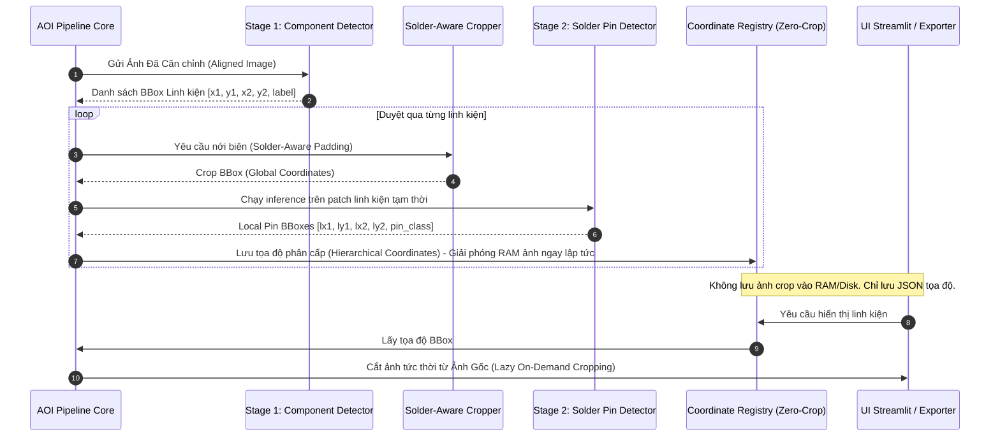

# Kế hoạch Kỹ thuật: Phát hiện Mối hàn 2 Giai đoạn Phân cấp (Hierarchical 2-Stage Solder Joint Detection)

> Phiên bản kế hoạch: `v1.0` — 2026-08-21  
> Trạng thái: Kế hoạch Thiết kế Kiến trúc & Tối ưu Bộ nhớ  
> Vị trí trong Pipeline: Bước 4 (Detect Linh kiện) $\to$ Bước 5 (Padding ROI) $\to$ Bước 5.5 / 6.2 (Detect & Chấm điểm Chân mối hàn)  
> Tài liệu liên quan: [Kế hoạch phân loại 6.1](./ke_hoach_pretrain_6_1_classification.md) | [Kế hoạch số hóa PCB](./ke_hoach_so_hoa_mach_pcb_aoi.md) | [Định dạng CAD](./cad_formats.md)

---

## 1. Đánh giá & Thẩm định Chiến lược (Evaluation & Rationale)

### 1.1 Hạn chế cốt tử của việc Detect Mối hàn Trực tiếp trên Ảnh Toàn Mạch (1-Stage)
* **Bất tương thích Tỉ lệ (Scale Mismatch):** Ảnh toàn bo mạch thường có kích thước rất lớn ($4000 \times 3000\text{ px}$ hoặc lớn hơn), trong khi một chân mối hàn (0402, QFP pitch $0.3\text{ mm}$) chỉ chiếm khoảng $10 \times 15\text{ px}$. Khi đưa vào mô hình YOLO với stride 32, một chân mối hàn nhỏ hơn cả một cell đặc trưng ($10\text{ px} < 32\text{ px}$), dẫn đến mất thông tin và lọt lỗi cực lớn.
* **Nhiễu nền & Báo động giả (False Alarms):** Trên toàn bo mạch có rất nhiều hoa văn dễ gây nhầm lẫn: via đồng mạ thiếc, chữ in lụa, góc bo mạch, đường mạch trace, linh kiện cơ khí. Detect trực tiếp trên ảnh lớn sẽ sinh ra hàng ngàn false positive.
* **Chi phí tính toán cao:** Chạy mô hình detection chi tiết ở độ phân giải siêu cao trên toàn board đòi hỏi chia hàng trăm tile nhỏ (Tiling), gây lãng phí tài nguyên ở các vùng board trống.

### 1.2 Ưu thế Vượt trội của Hướng tiếp cận 2 Giai đoạn (Coarse-to-Fine Hierarchical Detection)

1. **Tập trung 100% Trường nhìn (Receptive Field):** Sau khi crop linh kiện về kích thước $128 \times 128$ hoặc $256 \times 256$, chân mối hàn chiếm diện tích đủ lớn để mạng nơ-ron nhận diện rõ hình thái mặt khum, độ dày thiếc và các khuyết tật vi mô.
2. **Khử Nhiễu Tuyệt đối:** Detector chân mối hàn chỉ chạy bên trong phạm vi linh kiện đã được xác thực ở Giai đoạn 1.
3. **Phân tách Trách nhiệm (Separation of Concerns):** Stage 1 giải quyết bài toán "Linh kiện nằm ở đâu và loại gì?", Stage 2 giải quyết bài toán "Chân hàn của nó có chuẩn không?".

---

## 2. Kiến trúc Xử lý Chi tiết (Detailed Architecture)



---

## 3. Giải pháp Quản lý Bộ nhớ (Zero-Crop Lazy Architecture)

### 3.1 Vấn đề Phình Bộ nhớ (Memory Bloat)
* Một bo mạch công nghiệp trung bình có **500 – 2,000 linh kiện** và **2,000 – 8,000 chân mối hàn**.
* Nếu lưu ảnh crop cho từng linh kiện/mối hàn ($128 \times 128 \times 3 \text{ bytes} \approx 50\text{ KB}$/crop):
  $$\text{Dung lượng RAM/Disk} = 2,000 \times 50\text{ KB} + 8,000 \times 50\text{ KB} \approx 500\text{ MB} \text{ cho mỗi lần quét bo mạch!}$$
* Quét 100 bo mạch liên tục sẽ gây tràn RAM hệ thống (*Out-of-Memory Crash*).

### 3.2 Thiết kế Kiến trúc Tọa độ Không Lưu Ảnh (Zero-Crop Data Structure)
Hệ thống áp dụng cơ chế **Metadata-First**: Chỉ lưu trữ cấu trúc dữ liệu tọa độ số học (float32) và nhãn phân loại. Ảnh crop tạm thời trong RAM sẽ bị hủy ngay sau khi inference xong.

```python
from dataclasses import dataclass, field
from typing import Any

@dataclass(slots=True, frozen=True)
class SolderPinDetection:
    """Tọa độ và kết quả phân loại của 1 chân mối hàn (chỉ chiếm ~64 bytes)."""
    pin_id: str                          # Ví dụ: "pin_R12_1"
    local_bbox: tuple[float, float, float, float]   # [x1, y1, x2, y2] trong crop linh kiện
    global_bbox: tuple[float, float, float, float]  # [X1, Y1, X2, Y2] trên ảnh mạch lớn
    pin_label: str                       # "good", "insufficient", "bridge", "cold"...
    confidence: float
    metadata: dict[str, Any] = field(default_factory=dict)

@dataclass(slots=True)
class ComponentDetectionRecord:
    """Tọa độ linh kiện và danh sách chân mối hàn trực thuộc."""
    detection_id: str
    label: str
    confidence: float
    component_bbox: tuple[float, float, float, float]  # BBox linh kiện gốc [X1, Y1, X2, Y2]
    crop_bbox: tuple[float, float, float, float]       # BBox linh kiện đã nới biên
    solder_pins: list[SolderPinDetection] = field(default_factory=list)
```

### 3.3 Cơ chế Cắt ảnh Lười theo Yêu cầu (Lazy On-Demand Cropping)
* **Khi chạy kiểm tra tự động (Inspection Run):** Toàn bộ pipeline chạy thuần túy trên mảng NumPy của ảnh lớn và các tensor inference. Bộ nhớ chỉ giữ 1 ảnh mạch lớn và danh sách JSON tọa độ.
* **Khi Người dùng bấm xem chi tiết trên UI Streamlit / Xuất Báo cáo:**
  $$\text{Patch}(x, y) = \text{Image}_{\text{canonical}}[Y_1^{\text{crop}}:Y_2^{\text{crop}}, X_1^{\text{crop}}:X_2^{\text{crop}}]$$
  Hệ thống trích xuất ảnh tức thời trong $< 0.1\text{ ms}$ mà không cần đọc ghi file trên ổ cứng.

---

## 4. Chuẩn hóa & Quy đổi Hệ Tọa độ (Coordinate Transformation Math)

Cần phân biệt rõ và quy đổi chính xác giữa **3 Hệ Tọa độ**:

```
[1. Local Tensor Space]            [2. Component Crop Space]           [3. Global Canonical Board Space]
  (Detector input 128x128)   --->     (Raw Pixels W_crop x H_crop) --->    (Mạch lớn mm / px)
```

```mermaid
flowchart LR
    subgraph TensorSpace["1. Tensor Space (128x128)"]
        T["Tọa độ đầu ra Model [tx1, ty1, tx2, ty2]"]
    end
    subgraph CropSpace["2. Crop Space (Local)"]
        C["Tọa độ Cục bộ trong Crop [lx1, ly1, lx2, ly2]"]
    end
    subgraph GlobalSpace["3. Global Board Space"]
        G["Tọa độ Toàn cục Bo mạch [GX1, GY1, GX2, GY2]"]
    end
    subgraph MetricSpace["4. Metric Space (mm)"]
        M["Tọa độ Thực tế [mm_x1, mm_y1, mm_x2, mm_y2]"]
    end

    T -->|Un-letterbox / Un-scale| C
    C -->|Cộng Offset Gốc Crop (X1_crop, Y1_crop)| G
    G -->|Nhân scale px_per_mm & Homography| M
```

### 4.1 Công thức Toán học Quy đổi

Giả sử:
* Bounding Box nới biên của linh kiện trên ảnh mạch lớn là:
  $$\text{CropBBox}_{\text{global}} = (X_1^{\text{crop}}, Y_1^{\text{crop}}, X_2^{\text{crop}}, Y_2^{\text{crop}})$$
* Tọa độ chân mối hàn do Stage 2 phát hiện trong ảnh crop (sau khi un-letterbox) là:
  $$\text{PinBBox}_{\text{local}} = (x_1^{\text{local}}, y_1^{\text{local}}, x_2^{\text{local}}, y_2^{\text{local}})$$

**Công thức Quy đổi Tọa độ Toàn cục (Global Coordinates):**
$$\begin{cases}
X_1^{\text{global}} = X_1^{\text{crop}} + x_1^{\text{local}} \\
Y_1^{\text{global}} = Y_1^{\text{crop}} + y_1^{\text{local}} \\
X_2^{\text{global}} = X_1^{\text{crop}} + x_2^{\text{local}} \\
Y_2^{\text{global}} = Y_1^{\text{crop}} + y_2^{\text{local}}
\end{cases}$$

**Công thức Quy đổi sang Hệ Kích thước Thực tế ($\text{mm}$):**
$$(x_{\text{mm}}, y_{\text{mm}}) = \frac{(X_{\text{global}}, Y_{\text{global}})}{\text{pixels\_per\_mm}}$$

---

## 5. Yêu cầu Kỹ thuật cho Bước Detect Linh kiện (Stage 1 Requirements)

Để Stage 2 phát hiện chân mối hàn đạt độ tin cậy tuyệt đối, Bounding Box của Stage 1 phải thỏa mãn các tiêu chuẩn nghiêm ngặt:

### 5.1 Độ Chính xác & Độ Bao phủ (Recall & Localization Gate)
* **Không được sót linh kiện (Recall $\ge 99.0\%$):** Nếu Stage 1 bỏ sót linh kiện, toàn bộ chân hàn của linh kiện đó sẽ bị lọt lỗi (*Escape*).
* **Khử trùng lặp đa tỉ lệ (Cross-tile NMS & Adaptive Tiling):** Khi chạy tiling ảnh lớn, các linh kiện nằm ở mép cắt tile phải được gộp box hoàn chỉnh, không để lại mảnh box cụt.

### 5.2 Chiến lược Nới biên Theo Hướng Chân Hàn (Solder-Aware Contextual Padding)
Không dùng padding đồng nhất cho mọi linh kiện. Áp dụng cơ chế **Padding Bất đối xứng theo Hình học Chân (Asymmetric Lead Geometry)**:

| Loại Linh kiện | Hướng Bố trí Chân | Tỉ lệ Nới biên Trục Dài (Long Axis) | Tỉ lệ Nới biên Trục Ngắn (Short Axis) | Mục đích |
| :--- | :--- | :---: | :---: | :--- |
| **Chip 2 chân (0402, 0805, MELF)** | 2 đầu linh kiện | $+25\% \sim +35\%$ | $+10\%$ | Giữ trọn vẹn 2 pad hàn ở 2 đầu mà không lấn sang linh kiện bên cạnh |
| **SOT-23 / SOT-223** | 3 chân ở 2 cạnh đối | $+20\%$ | $+20\%$ | Bao trọn 3 chân chìa ra ngoài thân nhựa |
| **SOP / SOIC / TSSOP / QFP** | 2 hoặc 4 hàng chân | $+15\% \sim +25\%$ | $+15\% \sim +25\%$ | Giữ toàn bộ hàng chân chìa ra ngoài thân IC và cầu thiếc (*bridge*) |
| **BGA / QFN** | Chân nằm dưới đáy / viền | $+15\%$ | $+15\%$ | Bao quát vùng tiếp xúc thiếc xung quanh viền |

```
        ┌─────────────────── Solder-Aware Crop Boundary ───────────────────┐
        │                                                                  │
        │         ▲ +25% Padding (Chứa trọn Pad Hàn & Meniscus)           │
        │         │                                                        │
        │    ┌────┴────┐                                              │
        │    │ Solder  │                                              │
        │    │  Pad 1  │                                              │
        │    ├─────────┤                                              │
        │    │         │                                              │
        │ ◄──┤ Body IC ├──► +10% Padding (Tránh dính linh kiện bên cạnh)│
        │    │         │                                              │
        │    ├─────────┤                                              │
        │    │ Solder  │                                              │
        │    │  Pad 2  │                                              │
        │    └────┬────┘                                              │
        │         │                                                        │
        │         ▼ +25% Padding                                           │
        │                                                                  │
        └──────────────────────────────────────────────────────────────────┘
```

---

## 6. Lộ trình Triển khai Kỹ thuật (4 Bước)

| Bước | Nội dung công việc | Module liên quan | Tiêu chí nghiệm thu |
| :--- | :--- | :--- | :--- |
| **1. Cấu trúc Tọa độ & Zero-Crop** | - Thiết lập dataclass `SolderPinDetection`, `ComponentDetectionRecord` trong `models.py`.<br>- Triển khai hàm quy đổi tọa độ `local_to_global_bbox()`. | `aoi_pipeline/models.py`<br>`aoi_pipeline/cropping.py` | - Kiểm tra chuyển đổi tọa độ sai số $= 0.0\text{ px}$.<br>- Giải phóng 100% RAM ảnh crop sau inference. |
| **2. Tinh chỉnh Solder-Aware Padding** | - Bổ sung padding profile cho các nhóm footprint (0402, SOT-23, SOP, QFP).<br>- Giữ nguyên resolution gốc của ảnh canonial khi crop. | `aoi_pipeline/config.py`<br>`aoi_pipeline/cropping.py` | - 100% crop chứa đủ chân hàn và pad kim loại.<br>- Không bị cắt cụt pad ở biên ảnh. |
| **3. Tích hợp Stage 2 Solder Detector** | - Xây dựng detector thứ cấp chuyên nhận diện chân hàn bên trong crop linh kiện.<br>- Kết hợp với mô hình phân loại lỗi (`solder defect classifier`). | `aoi_pipeline/solder.py`<br>`aoi_pipeline/pipeline.py` | - Tốc độ inference Stage 2 $\le 1.0\text{ ms}$ / linh kiện.<br>- Phát hiện chính xác từng chân pad riêng lẻ. |
| **4. Tích hợp Giao diện UI & Lazy Cropping** | - Cập nhật `pipeline_bridge.py` để render overlay phân cấp.<br>- Thêm chức năng xem phóng to tức thời (Lazy Crop Viewer) trên Streamlit. | `app/pipeline_bridge.py`<br>`app/streamlit_app.py` | - Render mượt mà $>1,000$ mối hàn mà không tăng RAM của ứng dụng. |
