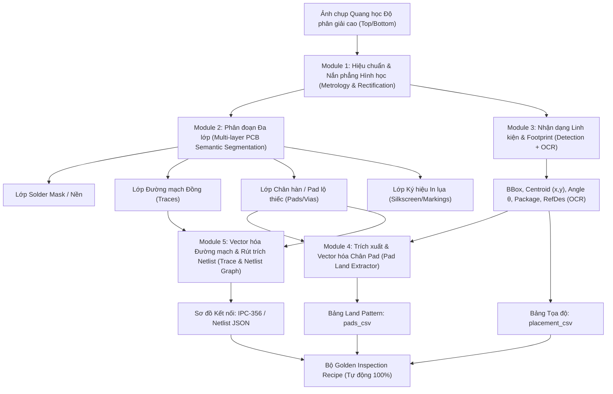
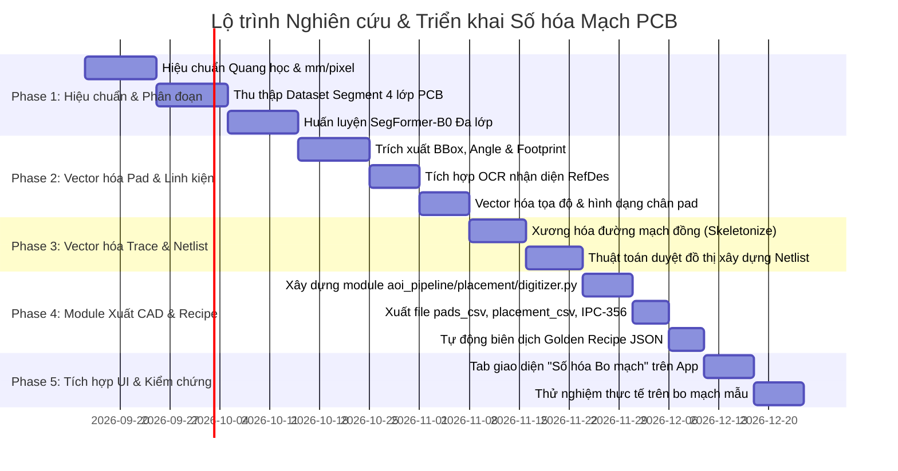

# Kế hoạch Nghiên cứu & Phát triển: Số hóa Mạch PCB trong Hệ thống AOI (PCB Digitization & Reverse Engineering)

> Phiên bản: `v1.0` — 2026-08-21  
> Trạng thái: Kế hoạch Nghiên cứu & Thiết kế Kiến trúc R&D  
> Mục tiêu chính: Tự động chuyển đổi ảnh quang học bo mạch vật lý (Golden / Bare / Assembled PCB) thành mô hình số hóa hoàn chỉnh (**Digital Twin / CAD / Netlist / Recipe**), phục vụ kiểm tra tự động không cần file thiết kế gốc.  
> Tài liệu liên quan: [Định dạng CAD hỗ trợ](../design/cad_formats.md) | [Detect mối hàn 2 giai đoạn](ke_hoach_detect_moi_han_2_giai_doan.md) | [Kế hoạch RNN/LSTM](ke_hoach_ung_dung_rnn_lstm_aoi_pcb.md) | [Kế hoạch phân loại 6.1](ke_hoach_pretrain_6_1_classification.md)

---

## 1. Bối cảnh & Mục tiêu Kỹ thuật

### 1.1 Vấn đề thực tế trong Sản xuất & Kiểm tra AOI
Trong quy trình kiểm tra quang học tự động truyền thống, hệ thống AOI phụ thuộc chặt chẽ vào file thiết kế gốc do xưởng thiết kế cung cấp (CAD Centroid, Gerber RS-274X, ODB++, IPC-D-356, BOM). Tuy nhiên, trong thực tế thường gặp các rào cản:
1. **Mất file thiết kế hoặc bo mạch di sản (Legacy Boards / Reverse Engineering):** Nhiều bo mạch cũ không còn lưu trữ file CAD/Gerber gốc.
2. **Xưởng gia công OEM/EMS không được chia sẻ đầy đủ file CAD gốc:** Do bảo mật sở hữu trí tuệ từ khách hàng.
3. **Mất thời gian tạo Recipe kiểm tra thủ công (Manual Recipe Setup):** Kỹ sư phải chấm điểm từng linh kiện, từng chân pad bằng tay, mất hàng giờ đồng hồ cho một mẫu bo mạch mới.

### 1.2 Mục tiêu của Tính năng "Số hóa Mạch PCB" (Image-to-CAD / Digital Twin)
Chỉ từ **ảnh chụp quang học độ phân giải cao** của bo mạch mẫu (Golden Board):
* Tự động bóc tách và vector hóa toàn bộ biên dạng bo mạch, lỗ ốc, fiducial.
* Tự động nhận diện, định danh linh kiện (RefDes, Package, Góc xoay, Tọa độ tâm mm).
* Tự động trích xuất toàn bộ land pattern (tọa độ chân pad, kích thước $W \times H$, hình dạng).
* Tự động vector hóa đường mạch đồng (copper traces) và suy diễn sơ đồ nối dây (**Netlist Topology**).
* Xuất thẳng ra các định dạng chuẩn công nghiệp: `pads_csv` (tương thích ngay với [`docs/design/cad_formats.md`](../design/cad_formats.md)), `placement_csv`, `IPC-356` và `recipe.json` cho Golden Inspection.

---

## 2. Kiến trúc Hệ thống Số hóa Mạch PCB (Image-to-CAD Pipeline)



---

## 3. Chi tiết 5 Khối Xử lý Cốt lõi (Core Modules)

### Module 1: Hiệu chuẩn Quang học & Nắn phẳng Hình học (Metrology & Rectification)
* **Quy đổi Pixel sang Milimet ($px \leftrightarrow mm$):** Sử dụng bàn chuẩn độ cờ carô (Checkerboard) hoặc vòng tròn đồng tâm (Dot Grid Target) để tính toán chính xác hệ số `pixels_per_mm`.
* **Khử méo phi tuyến & Phối cảnh:** Loại bỏ méo cầu (radial distortion $k_1, k_2$) và méo tiếp tuyến ($p_1, p_2$). Dùng 4 điểm góc bo mạch hoặc fiducials để nắn phẳng phối cảnh (Perspective Warp) về hệ tọa độ trực giao chuẩn $\text{mm}$.

---

### Module 2: Phân đoạn Ngữ nghĩa Đa lớp (Deep Multi-Layer PCB Segmentation)
Sử dụng mô hình mạng phân đoạn ngữ nghĩa nhẹ (ví dụ `SegFormer-B0` hoặc `U-Net MobileNetV3`) để phân tách 4 kênh mặt nạ nhị phân:
1. **$M_{\text{substrate}}$ (Nền cách điện):** Màu xanh lá, đen, xanh dương của lớp phủ solder mask.
2. **$M_{\text{copper}}$ (Đường mạch đồng):** Mạng lưới đường dây chạy chìm dưới lớp phủ và vùng phủ mass (ground plane).
3. **$M_{\text{pad}}$ (Pad mạ thiếc/vàng & Lỗ Via):** Các vùng kim loại sáng màu lộ ra ngoài phục vụ hàn linh kiện.
4. **$M_{\text{silk}}$ (Mực in lụa):** Chữ in RefDes (`R12`, `C5`, `U1`), khung viền linh kiện, dấu chấm cực tính (Polarity dot / Pin 1 mark).

---

### Module 3: Vector hóa Linh kiện & Nhận dạng Ký tự (Component & OCR Vectorization)
* **Xác định Tọa độ & Góc xoay:** Từ Step 4 (Detector) + Step 6.1 (Classifier), xác định Bounding Box, tâm linh kiện $(x_c, y_c)$ và hướng xoay $\theta \in [0^\circ, 360^\circ)$.
* **Footprint Matching:** Đối chiếu tỉ lệ $W/H$ và diện tích với thư viện footprint chuẩn IPC (0402, 0603, 0805, 1206, SOT-23, SOIC-8, QFP-48, BGA).
* **OCR Nhận dạng Reference Designator:** Trích xuất lớp chữ in lụa $M_{\text{silk}}$ xung quanh linh kiện, sử dụng bộ đọc OCR công nghiệp nhẹ (CRNN / PaddleOCR-Mobile) để trích xuất mã linh kiện (`R1`, `C2`, `U4`, `D1`).

---

### Module 4: Trích xuất Land Pattern & Chân Pad (Pad Land Extraction)
* **Khối hình học:** Kết hợp giữa lớp kim loại $M_{\text{pad}}$ và Bounding box linh kiện để bóc tách từng chân pad riêng lẻ.
* **Vector hóa Pad:**
  - Tọa độ tâm pad $(x_{\text{pad}}, y_{\text{pad}})$ quy đổi sang $\text{mm}$.
  - Kích thước $w_{\text{mm}} \times h_{\text{mm}}$.
  - Hình dạng pad: `rect` (chữ nhật), `round` (tròn - via/THT), `oval` (bầu dục).
  - Tự động đánh số thứ tự pin: Chân 1 (dựa trên dấu chấm cực tính silkscreen hoặc góc vát) $\to$ chân $2 \dots N$ theo chiều ngược kim đồng hồ (chuẩn IPC).

---

### Module 5: Vector hóa Đường mạch & Khôi phục Sơ đồ Netlist (Trace Vectorization & Netlist Graph)
* **Xương hóa đường mạch (Skeletonization / Medial Axis Transform):**
  - Rút gọn dải đồng $M_{\text{copper}}$ thành các đường khung đơn điểm (1-pixel centerline).
  - Trích xuất các điểm nút (Nodes: Ngã 3, Ngã 4, Điểm kết thúc).
* **Xây dựng Đồ thị Topology (Graph Construction):**
  - Biểu diễn bo mạch thành đồ thị vô hướng $G = (V, E)$, trong đó $V$ là tập hợp các Chân Pad & Điểm nối, $E$ là các đoạn mạch đồng kết nối giữa chúng.
  - Sử dụng thuật toán duyệt đồ thị (Connected Components / BFS) để nhóm các pad cùng nối chung vào một **Net** (ví dụ: `Net_VCC`, `Net_GND`, `Net_12`).
  - Xuất ra file sơ đồ kết nối chuẩn **IPC-D-356A**.

---

## 4. Đặc tả Định dạng Xuất khẩu (Data Output Contracts)

### 4.1 Bảng Pad Land Pattern (`board_pads.csv`)
Tương thích 100% với trình nạp CAD sẵn có trong [`docs/design/cad_formats.md`](../design/cad_formats.md):

```csv
designator,pin,x_mm,y_mm,width_mm,height_mm,rotation_deg,shape,net,side,footprint,value
R1,1,10.500,20.000,0.90,1.00,0,rect,NET1,top,R_0603,UNKNOWN
R1,2,12.100,20.000,0.90,1.00,0,rect,NET_GND,top,R_0603,UNKNOWN
U1,1,30.000,15.000,0.35,1.20,0,rect,NET_SDA,top,SOIC-8,UNKNOWN
U1,2,31.270,15.000,0.35,1.20,0,rect,NET_SCL,top,SOIC-8,UNKNOWN
```

### 4.2 Bảng Vị trí Đặt Linh kiện (`placement_csv`)

```csv
Designator,Mid X,Mid Y,Rotation,Layer,Footprint,Comment
R1,11.300,20.000,0,Top,R_0603,resistor
U1,32.500,16.500,0,Top,SOIC-8,ic
```

### 4.3 Tự động sinh Golden Inspection Recipe (`recipe.json`)
Kết quả số hóa được biên dịch trực tiếp thành recipe kiểm tra cho hệ thống Golden Inspection:

```json
{
  "schema_version": "aoi-inspection-recipe/1.0",
  "board_id": "DIGITIZED_BOARD_REV1",
  "source": "optical_digitization",
  "metrology": {
    "pixels_per_mm": 35.42,
    "position_tolerance_xy_mm": 0.15,
    "rotation_tolerance_deg": 3.0
  },
  "slots": [
    {
      "slot_id": "SLOT_0001",
      "refdes": "R1",
      "expected_class": "resistor",
      "center_mm": [11.300, 20.000],
      "expected_angle_deg": 0.0,
      "footprint": "R_0603",
      "pads": [
        {"pin": 1, "center_mm": [10.500, 20.000], "size_mm": [0.90, 1.00]},
        {"pin": 2, "center_mm": [12.100, 20.000], "size_mm": [0.90, 1.00]}
      ]
    }
  ]
}
```

---

## 5. Lộ trình Triển khai Kỹ thuật (5 Giai đoạn)



### Phase 1: Hiệu chuẩn Hình học & Phân đoạn Ngữ nghĩa Đa lớp (Tuần 1–4)
- Viết module `aoi_pipeline/imaging/calibration.py` tính `pixels_per_mm` và hiệu chỉnh phối cảnh homography.
- Huấn luyện mô hình phân đoạn ngữ nghĩa `SegFormer-B0` phân chia 4 lớp vật lý ($M_{\text{substrate}}, M_{\text{copper}}, M_{\text{pad}}, M_{\text{silk}}$).
- Nghiệm thu: mIoU phân đoạn ngữ nghĩa $\ge 0.88$.

### Phase 2: Vector hóa Linh kiện, Footprint & OCR Ký tự (Tuần 5–7)
- Kết hợp kết quả Detection Bước 4 và phân loại Bước 6.1 để xác định tâm $(x_c, y_c)$ và góc $\theta$.
- Tích hợp PaddleOCR/CRNN để đọc ký tự RefDes từ lớp silkscreen $M_{\text{silk}}$.
- Nghiệm thu: Độ chính xác đọc RefDes $\ge 92\%$, sai số góc xoay $\le 1.5^\circ$.

### Phase 3: Vector hóa Đường mạch Đồng & Suy diễn Netlist (Tuần 8–10)
- Áp dụng giải thuật Medial Axis Transform để xương hóa đường mạch đồng $M_{\text{copper}}$.
- Xây dựng đồ thị liên thông $G=(V, E)$ giữa các chân Pad và Trace để xác định các mạng dây (**Nets**).
- Nghiệm thu: Khôi phục chính xác $\ge 95\%$ các kết nối mạng 1 lớp / 2 lớp lộ thiên.

### Phase 4: Xây dựng Module Xuất CAD & Tự động sinh Recipe (Tuần 11–12)
- Tạo module lõi `aoi_pipeline/placement/digitizer.py`.
- Tạo các exporter: `export_pads_csv()`, `export_placement_csv()`, `export_ipc356()`, `export_recipe_json()`.
- Kiểm tra tính tương thích 100% với bộ nạp `CAD_LOADERS` trong [`aoi_pipeline/solder/cad.py`](../../aoi_pipeline/solder/cad.py).

### Phase 5: Tích hợp Giao diện UI Streamlit & Đánh giá Thực tế (Tuần 13–14)
- Thêm workspace **"Số hóa Mạch PCB (PCB Digitization)"** trên giao diện Streamlit:
  - Tải ảnh bo mạch mẫu $\to$ Nút bấm **"Bắt đầu Số hóa"**.
  - Hiển thị lớp overlay các vector pad, đường mạch, tên linh kiện theo thời gian thực.
  - Nút tải về bộ file: `board_pads.csv`, `placement.csv`, `recipe.json`.
- Kiểm thử toàn diện và đánh giá sai số đo lường hình học (Geometric Error $\le 0.05\text{ mm}$).

---

## 6. Đánh giá Rủi ro Kỹ thuật & Giải pháp Phòng ngừa

| Rủi ro Kỹ thuật | Mức độ | Giải pháp Phòng ngừa |
| :--- | :---: | :--- |
| **Mạch nhiều lớp (Multi-layer Inner Traces):** Các đường mạch nằm ở lớp trong (Inner layers) không thể nhìn thấy bằng camera quang học 2D. | Cao | - Xác định rõ phạm vi: Số hóa quang học chỉ khôi phục các đường mạch lớp ngoài (Top/Bottom surface layers).<br>- Với các lớp bên trong, kết nối thông qua lỗ Via vẫn được ghi nhận thành các điểm Net trung gian. |
| **Mực in lụa bị mờ hoặc mất chữ RefDes:** Chữ in lụa bị xước hoặc chồng lên pad. | Trung bình | Tự động sinh RefDes giả định theo quy ước chuẩn: `U_auto_1`, `R_auto_1` dựa trên loại linh kiện và tọa độ không gian từ trên xuống dưới, từ trái sang phải. |
| **Bề mặt kim loại bị oxy hóa / đổi màu:** Làm sai lệch phân đoạn mặt nạ kim loại $M_{\text{pad}}$. | Thấp | Tích hợp tiền xử lý cân bằng trắng (White Balance) + CLAHE và huấn luyện mô hình phân đoạn với dữ liệu tăng cường độ sáng / màu sắc đa dạng. |
